# STR8-N v1.32 Maps and Diagrams

These diagrams describe the host-qualified and board-derived v1.32 release.

## Ownership

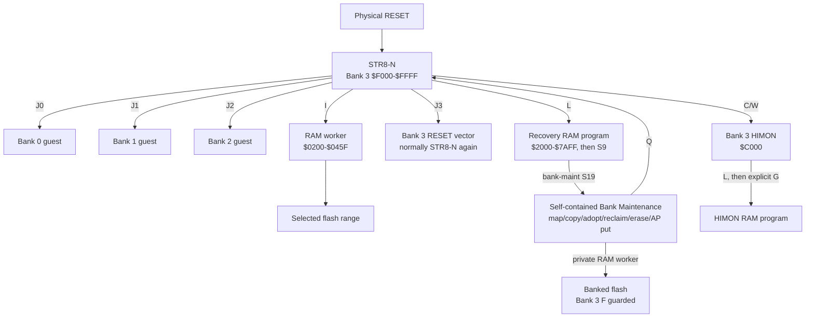

## Build and artifact flow

```text
BUILD/
|-- v1.32/
|   |-- bin/                 all STR8-N binary images
|   |-- s19/                 all release and user-built S19 images
|   `-- test/range-matrix/   generated S19 qualification fixtures
|-- str8n-manifest.json      stable R-YORS discovery path
|-- obj/                     assembler intermediates
|-- lst/                     listings
`-- sym/                     symbols
```

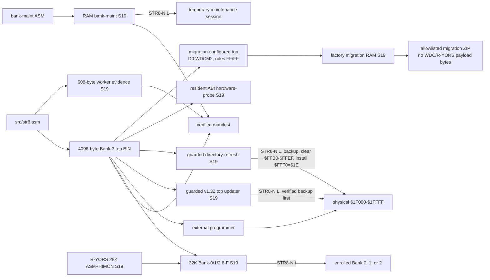

The top updater preserves the live directory pocket. The directory-refresh
artifact deliberately replaces that pocket with `$FF`, after first verifying
a full live-sector backup in Bank 1 sector F. Bank Maintenance `D` can then
adopt a payload into an erased row without rewriting payload bytes.

## Physical flash to CPU view

```text
physical flash       bank     CPU view
$00000-$07FFF        0        $8000-$FFFF
$08000-$0FFFF        1        $8000-$FFFF
$10000-$17FFF        2        $8000-$FFFF
$18000-$1EFFF        3        $8000-$EFFF payload
$1F000-$1FFFF        3        $F000-$FFFF protected STR8-N
```

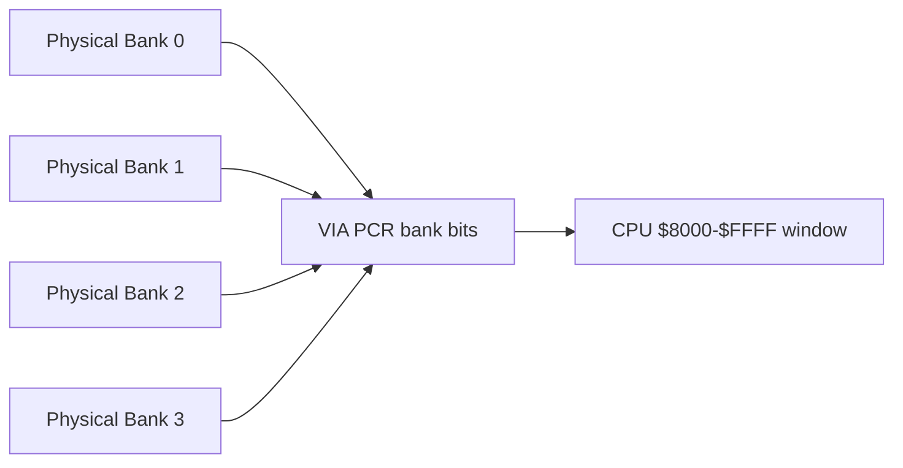

## Boot and handoff

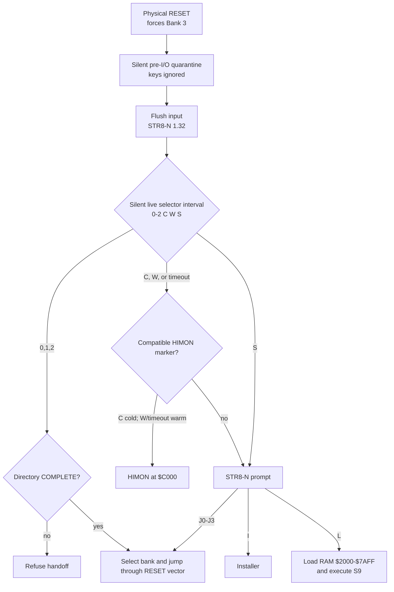

## Factory WDCMONv2 migration

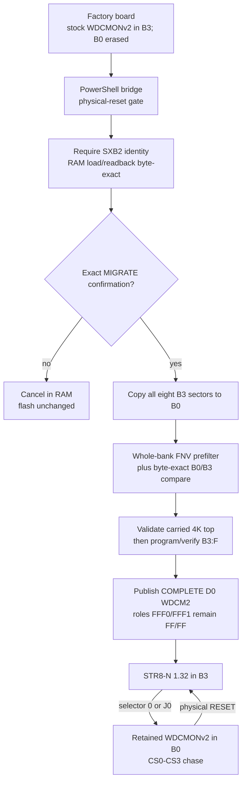

The accepted minimal path never writes B1 or B2 and does not install HIMON,
ASM-F2, or R-YORS. The optional read-only archive path remains available for
additional owner-local evidence but is not a gate for an erased-B0 factory
board.

## Install transaction

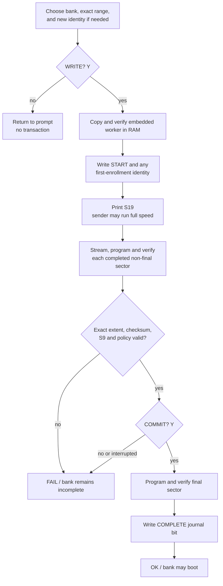

`WRITE? Y` is the persistent boundary. START is already written when `S19`
appears; a missing or bad transfer therefore requires full-range recovery.

## Directory state and launch gate

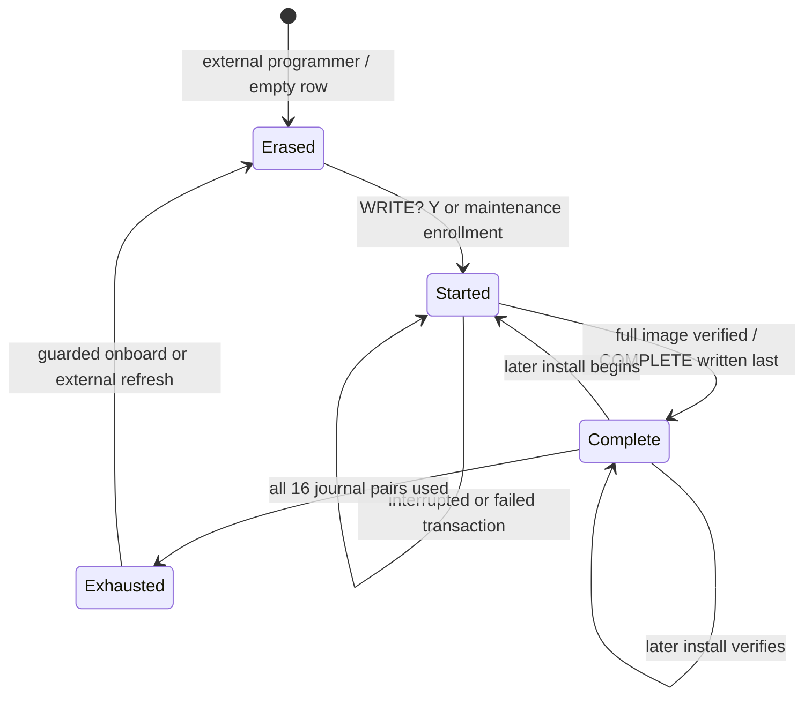

`J0`-`J2` accept only `Complete`. Bank Maintenance `C` accepts only `Erased`
destination rows. Bank Maintenance `D` can adopt an existing payload only into
an `Erased` row; neither command overwrites or repairs an existing identity.
After proving all eight sectors of a Bank 0-2 payload are erased, `R` can
return only that bank's stale row to `Erased` by rewriting and verifying the
complete guarded Bank-3 sector F. It first keeps a verified original B3F copy
in the selected bank's sector F and erases that temporary backup only after
the protected rewrite verifies.

## Protected 4K top sector

```text
$FFFF  +------------------------------+
       | hardware vectors       6 B   |
$FFF9  +------------------------------+
       | WORK=$1E + reserve     10 B   |
$FFEF  +------------------------------+
       | bank directory        64 B   |
$FFAF  +------------------------------+
       | stored worker        608 B   |
$FD4F  +------------------------------+
       | available growth      10 B   |
$FD45  +------------------------------+
       | resident code/data  3398 B   |
$F000  +------------------------------+
```

## Legal top-aligned install sizes

```text
Banks 0-2, ending at $FFFF       Bank 3, ending below STR8-N
 4K  F    $F000-$FFFF            4K  E    $E000-$EFFF
 8K  E-F  $E000-$FFFF            8K  D-E  $D000-$EFFF
12K  D-F  $D000-$FFFF           12K  C-E  $C000-$EFFF
16K  C-F  $C000-$FFFF           16K  B-E  $B000-$EFFF
20K  B-F  $B000-$FFFF           20K  A-E  $A000-$EFFF
24K  A-F  $A000-$FFFF           24K  9-E  $9000-$EFFF
28K  9-F  $9000-$FFFF           28K  8-E  $8000-$EFFF
32K  8-F  $8000-$FFFF
```

These are useful top-aligned examples, not a restriction. Any contiguous
sector span inside `8-F` (Banks 0-2) or `8-E` (Bank 3) is accepted. `I` always
writes flash. STR8-N `L` is a separate recovery RAM load-and-execute path.

## Full R-YORS Bank-0/1/2 image

```text
$FFFF  +------------------------------+
       | STR8-N clone + vectors       |
$F000  +------------------------------+
       | HIMON                        |
$C000  +------------------------------+
       | ASM-F2                       |
$8000  +------------------------------+

range: $8000-$FFFF (8-F), 32768 bytes
S9:    $F000, matching RESET at $FFFC-$FFFD
```

This image is built from the current R-YORS `8-E` payload and the current
STR8-N top BIN. It is not used to update Bank 3 sector F.

## Flash install versus RAM load

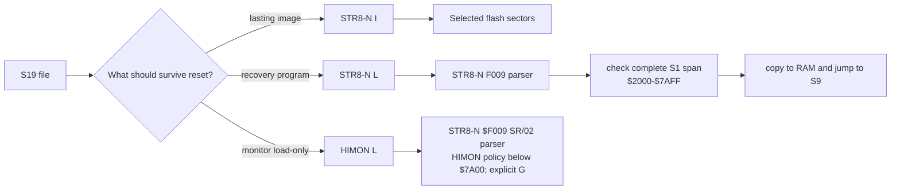

## Recovery RAM load

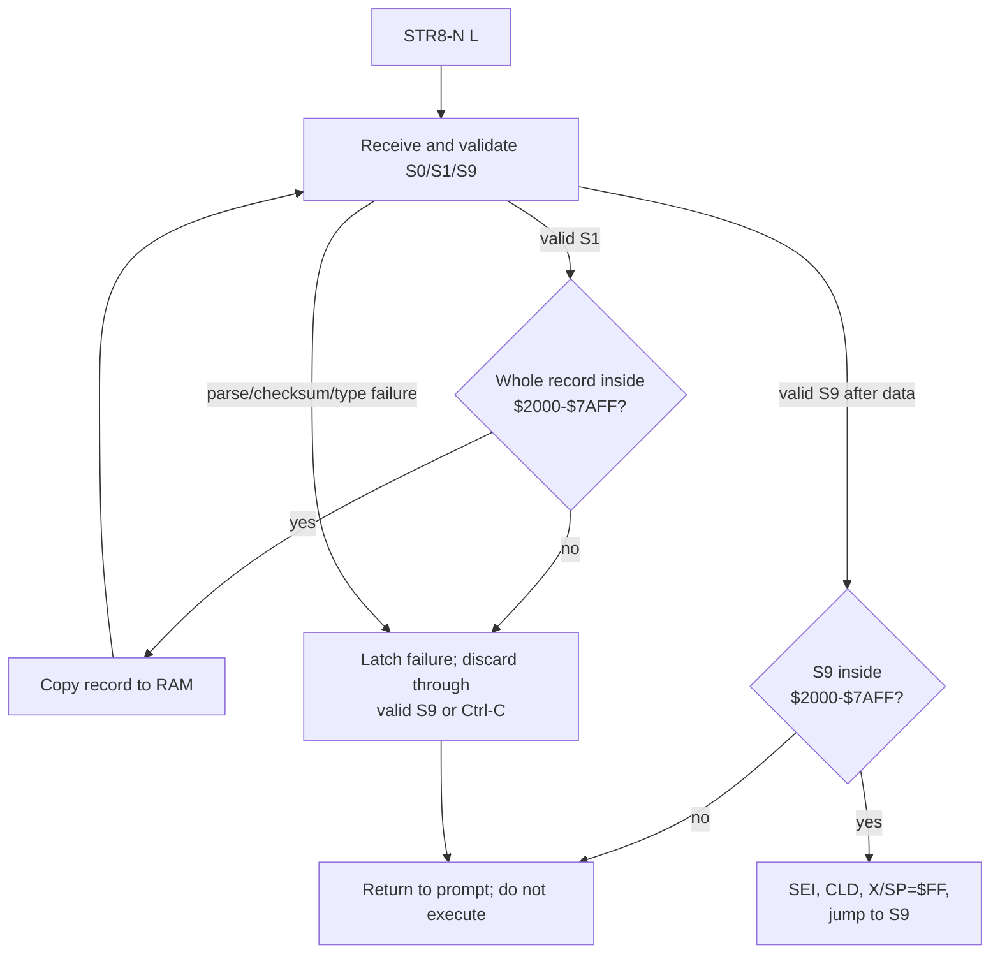

## STR8-N v1.32 RAM ownership

```text
$7DFF  +------------------------------+
       | STR8 state $7DE7-$7DFF       |
$7DE6  +------------------------------+
       | reserved $7DC8-$7DE6         |
$7DC7  +------------------------------+
       | HIMON AP link $7DC0-$7DC7    |
$7DBF  +------------------------------+
       | High Tool Overlay            |
       | $7C00-$7DBF                  |
$7BFF  +------------------------------+
       | monitor / record service RAM |
       +------------------------------+
$1FFF  +------------------------------+
       | standalone STR8 user-low RAM |
       | $1A00-$1FFF                  |
$19FF  +------------------------------+
       | 4K sector tray $0A00-$19FF  |
$09FF  +------------------------------+
       | free WCT tail $0460-$09FF    |
       | allocate down from $09FF     |
$045F  +------------------------------+
       | current worker $0200-$045F   |
$01FF  +------------------------------+
       | stack                        |
$00FF  +------------------------------+
       | state and ZP scratch         |
$0000  +------------------------------+
```

STR8-N itself leaves `$1A00-$1FFF` free for user programs in v1.32. In the
integrated R-YORS payload, APMAN transiently uses `$1A00-$1AFF` as its command
shadow while `AP`, `APS`, or banked `INSTALL` delegates; `$1B00-$1FFF` remains
the unconditional user-low slice outside another phase owner. The whole `$0200-$09FF` Worker
Code Tray (WCT) remains phase-owned and volatile during worker calls, but the
maintained runtime workers do not extend above `$045F`: the unified STR8-N
worker ends at `$045F`, the Bank Maintenance private worker ends at `$042A`,
and HIMON's bank-safe helpers end below both. A phase-local allocator may
therefore consume the currently free `$0460-$09FF` tail downward from `$09FF`,
provided it checks its low-water mark against the published exclusive
`STR8_WORKER_END` and does not expect those bytes to survive a worker call.
Development and proof programs may still use other addresses in the WCT and
are not covered by this maintained-runtime high-water guarantee.

Bank Maintenance and the other foreground tools use the single-owner
`$7C00-$7DBF` overlay. The exact `$7DE7-$7DFF` Recovery State Capsule fields
are listed in the [Technical Guide](TECHNICAL_GUIDE.md#str8-n-v130-high-ram-abi).

## RAM capacity by operating path

```text
Board RAM below I/O                         32,512 bytes  $0000-$7EFF
STR8-N L accepted window                    23,296 bytes  $2000-$7AFF
I named transient/service areas              5,014 bytes  excluding L flag
Fixed IVI cells                                  11 bytes
Maximum hardware stack                         256 bytes  dynamic
Outside named I/fixed areas                  27,487 bytes  before stack use
R-YORS normal application convention         18,694 bytes  monitor-dependent
Bank-maint loaded image                       6,579 bytes  $2000-$39B2
```

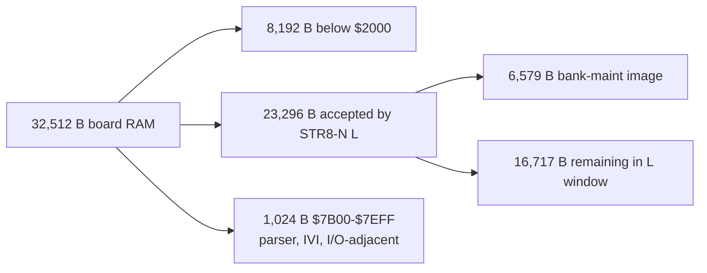

The numbers describe STR8-N boundaries, not a promise that HIMON, ASM, or an
arbitrary guest leaves every other byte unused.

## Bank-maintenance RAM tool

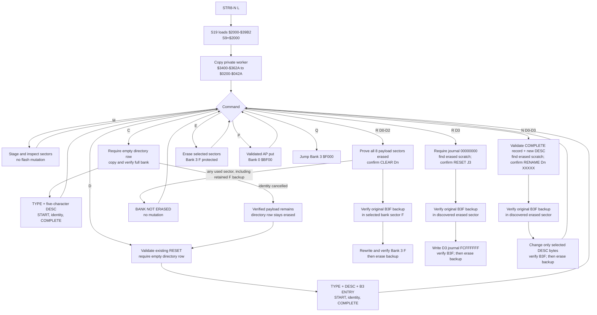

```text
$0200-$042A  runtime private mutation worker       555 bytes
$0A00-$19FF  staged flash sector                  4096 bytes
$7C00-$7D1A  maintenance state/tables              283 bytes allocated
$2000-$39B2  loaded program, worker, extensions     6579 bytes
```

The isolated STR8-iN/65 maintenance image used during WDC migration is a
separate `$2000-$3B15` / 6,934-byte artifact. It adds prompted defaults for
adoption and the scoped-search `F` byte, remains outside the canonical
manifest and migration ZIP, and is not required by the current migrator
because that migrator already publishes COMPLETE D0 `WDCM2`.

## Accepted v1.29 factory-board path

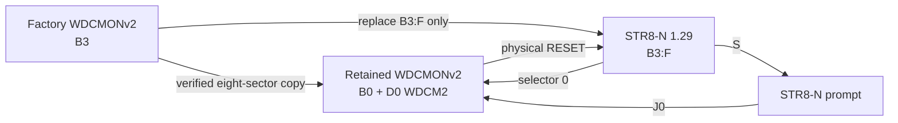

The 2026-08-28 board capture proves the copy, candidate verification, STR8-N
launch, full retained EDU application startup, and final physical RESET.
The operator separately observed the expected CS0-CS3 chase.

## Accepted v1.21 board path

> [!NOTE]
> Archived v1.21 acceptance topology. It is retained as hardware evidence, not
> as a current v1.32 operating procedure or memory map.

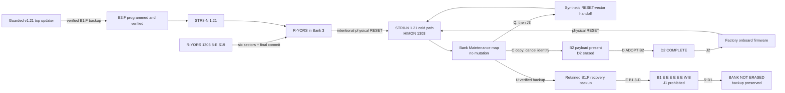

This complete path is board-accepted. The one failed intermediate `8-E`
transfer stopped before `COMMIT`; a clean retry completed, preserving the
fail-closed transaction boundary. The 2026-08-18 continuation adds the
copy-cancel-adopt-`J2` path and the retained-B1:F reclaim refusal shown above.

## Supported interfaces

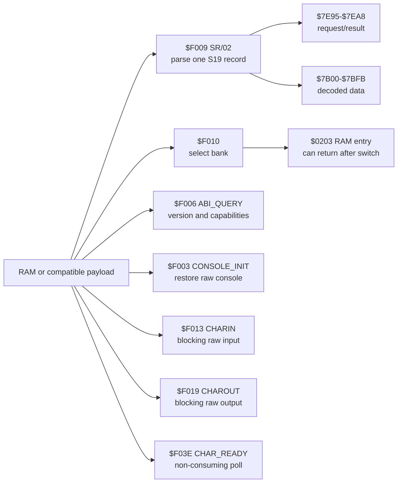
