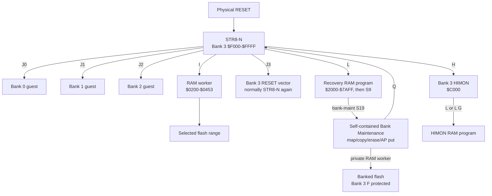
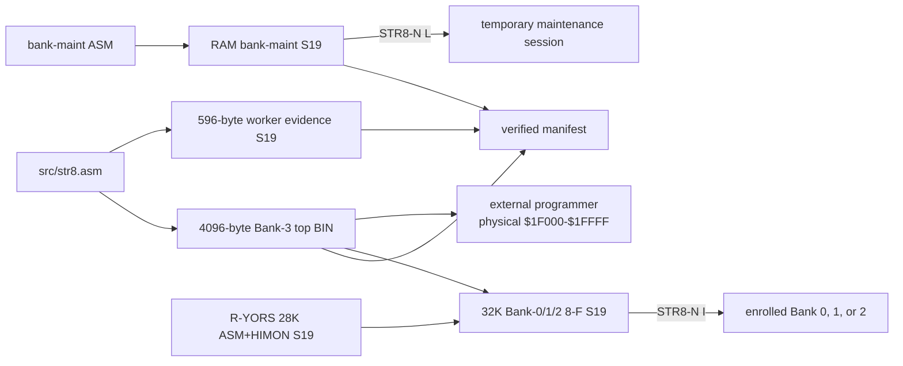
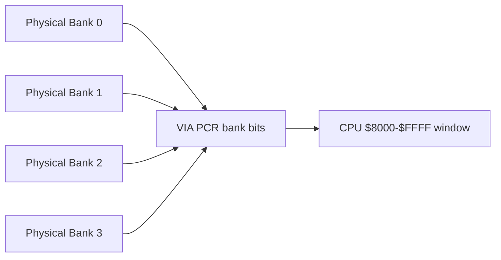
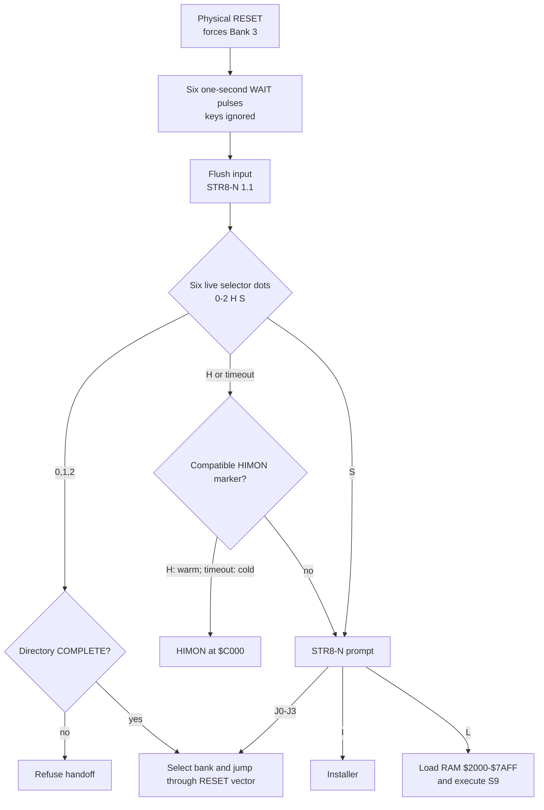
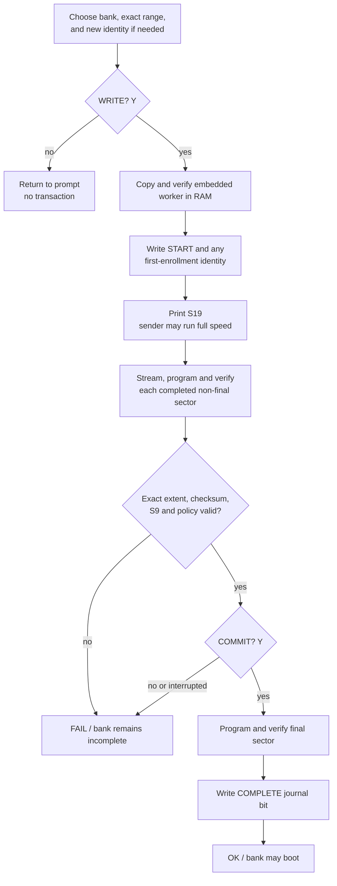
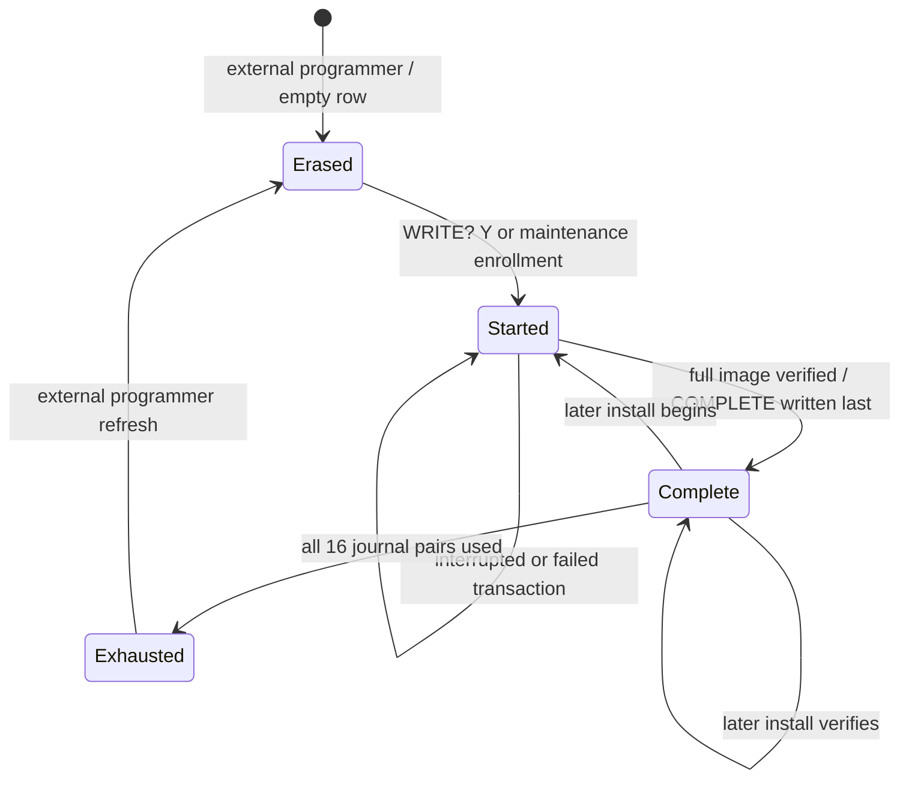
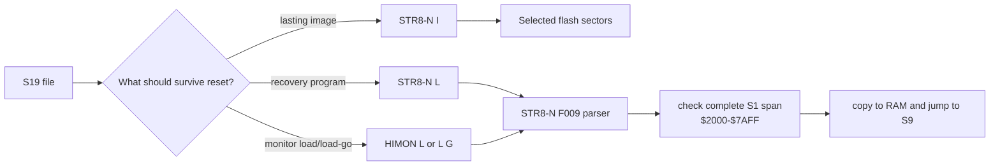
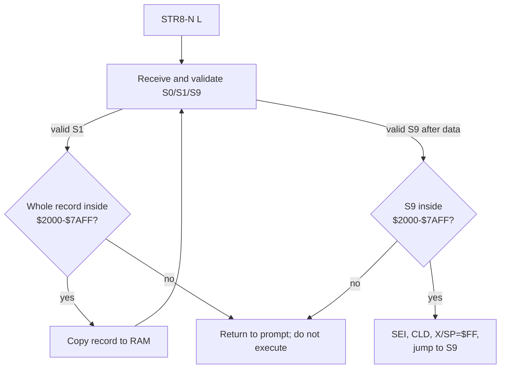
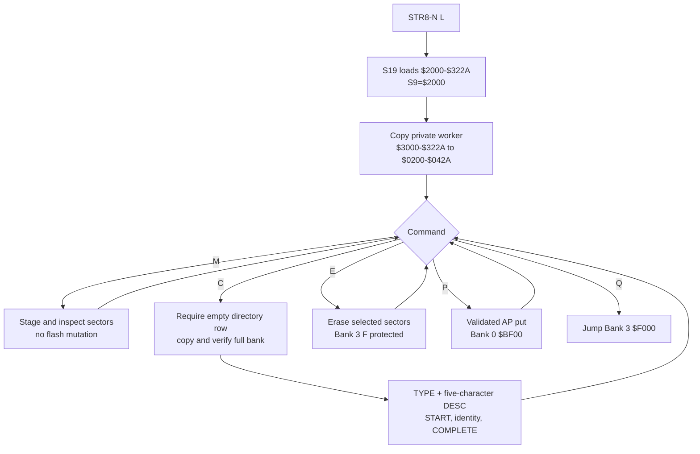
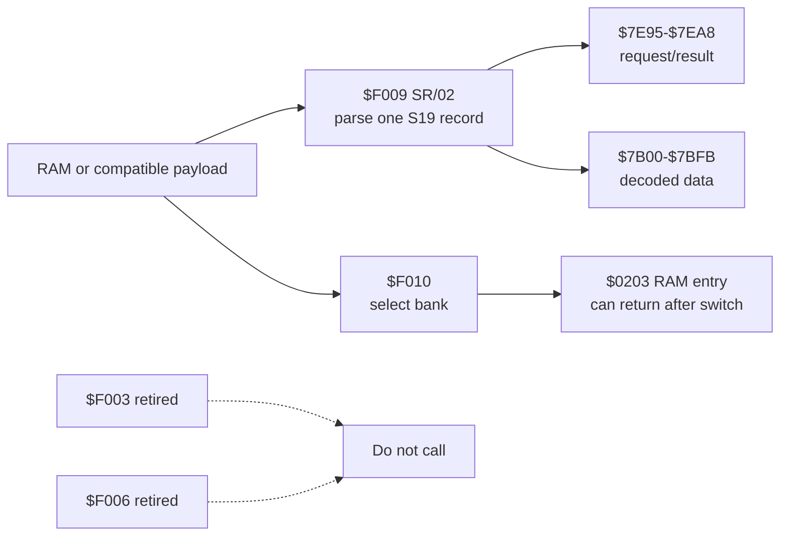

# STR8-N v1.1 Maps and Diagrams

These diagrams describe the current v1.1 implementation.

## Ownership



## Build and artifact flow

```text
BUILD/
|-- v1.1/
|   |-- bin/                 all STR8-N binary images
|   |-- s19/                 all release and user-built S19 images
|   `-- test/range-matrix/   generated S19 qualification fixtures
|-- str8n-manifest.json      stable R-YORS discovery path
|-- obj/                     assembler intermediates
|-- lst/                     listings
`-- sym/                     symbols
```



## Physical flash to CPU view

```text
physical flash       bank     CPU view
$00000-$07FFF        0        $8000-$FFFF
$08000-$0FFFF        1        $8000-$FFFF
$10000-$17FFF        2        $8000-$FFFF
$18000-$1EFFF        3        $8000-$EFFF payload
$1F000-$1FFFF        3        $F000-$FFFF protected STR8-N
```



## Boot and handoff



## Install transaction



`WRITE? Y` is the persistent boundary. START is already written when `S19`
appears; a missing or bad transfer therefore requires full-range recovery.

## Directory state and launch gate



`J0`-`J2` accept only `Complete`. Bank Maintenance `C` accepts only `Erased`
destination rows; it does not overwrite or repair an existing identity.

## Protected 4K top sector

```text
$FFFF  +------------------------------+
       | hardware vectors       6 B   |
$FFF9  +------------------------------+
       | configuration         10 B   |
$FFEF  +------------------------------+
       | bank directory        64 B   |
$FFAF  +------------------------------+
       | stored worker        596 B   |
$FD5B  +------------------------------+
       | free margin            8 B   |
$FD53  +------------------------------+
       | resident code/data  3412 B   |
$F000  +------------------------------+
```

## Legal top-aligned install sizes

```text
Banks 0-2, ending at $FFFF       Bank 3, ending below STR8-N
 4K  F    $F000-$FFFF            4K  E    $E000-$EFFF
 8K  E-F  $E000-$FFFF            8K  D-E  $D000-$EFFF
12K  D-F  $D000-$FFFF           12K  C-E  $C000-$EFFF
16K  C-F  $C000-$FFFF           16K  B-E  $B000-$EFFF
20K  B-F  $B000-$FFFF           20K  A-E  $A000-$EFFF
24K  A-F  $A000-$FFFF           24K  9-E  $9000-$EFFF
28K  9-F  $9000-$FFFF           28K  8-E  $8000-$EFFF
32K  8-F  $8000-$FFFF
```

These are useful top-aligned examples, not a restriction. Any contiguous
sector span inside `8-F` (Banks 0-2) or `8-E` (Bank 3) is accepted. `I` always
writes flash. STR8-N `L` is a separate recovery RAM load-and-execute path.

## Full R-YORS Bank-0/1/2 image

```text
$FFFF  +------------------------------+
       | STR8-N clone + vectors       |
$F000  +------------------------------+
       | HIMON                        |
$C000  +------------------------------+
       | ASM-F2                       |
$8000  +------------------------------+

range: $8000-$FFFF (8-F), 32768 bytes
S9:    $F000, matching RESET at $FFFC-$FFFD
```

This image is built from the current R-YORS `8-E` payload and the current
STR8-N top BIN. It is not used to update Bank 3 sector F.

## Flash install versus RAM load



## Recovery RAM load



## Transient RAM during install

```text
$1FFF  +------------------------------+
       | update state $1FE9-$1FFF     |
$1FE8  +------------------------------+
       | other RAM                    |
$19FF  +------------------------------+
       | 4K sector tray $0A00-$19FF  |
$09FF  +------------------------------+
       | other RAM                    |
$0453  +------------------------------+
       | worker $0200-$0453           |
$01FF  +------------------------------+
       | stack                        |
$00FF  +------------------------------+
       | state and ZP scratch         |
$0000  +------------------------------+
```

## RAM capacity by operating path

```text
Board RAM below I/O                         32,512 bytes  $0000-$7EFF
STR8-N L accepted window                    23,296 bytes  $2000-$7AFF
I named transient/service areas              5,015 bytes  excluding L flag
Fixed delay and IVI cells                        13 bytes
Maximum hardware stack                         256 bytes  dynamic
Outside named I/fixed areas                  27,484 bytes  before stack use
R-YORS normal application convention         18,694 bytes  monitor-dependent
Bank-maint loaded image                       4,651 bytes  $2000-$322A
```


The numbers describe STR8-N boundaries, not a promise that HIMON, ASM, or an
arbitrary guest leaves every other byte unused.

## Bank-maintenance RAM tool



```text
$0200-$042A  runtime private mutation worker       555 bytes
$0A00-$19FF  staged flash sector                  4096 bytes
$1B00-$1DDA  maintenance state                     731 bytes
$2000-$322A  loaded program, padding, stored worker 4651 bytes
```

## Supported interfaces


