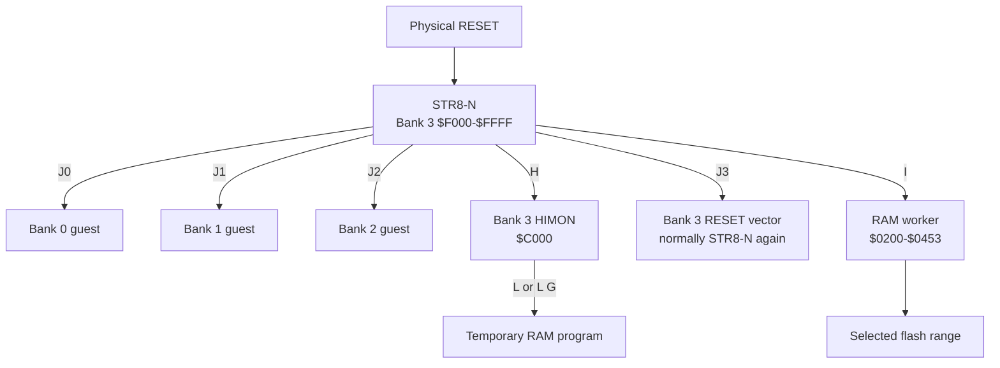
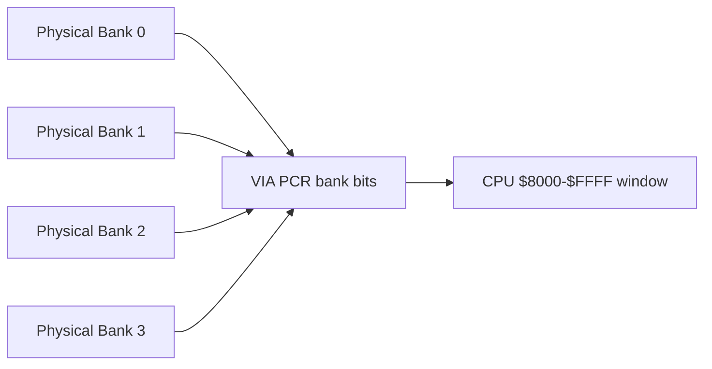
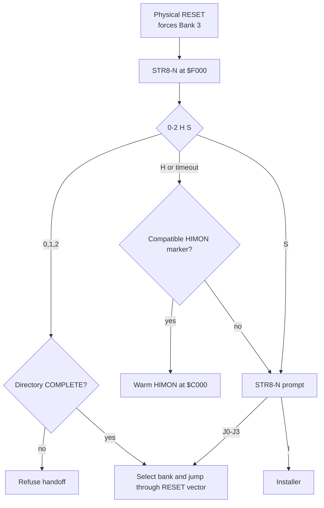
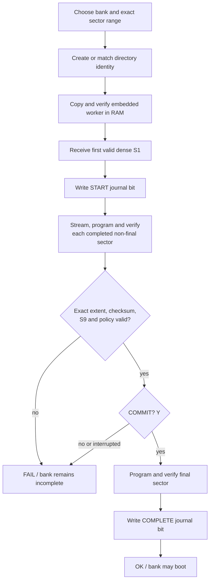
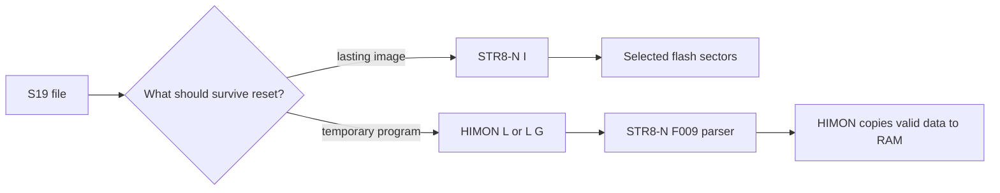
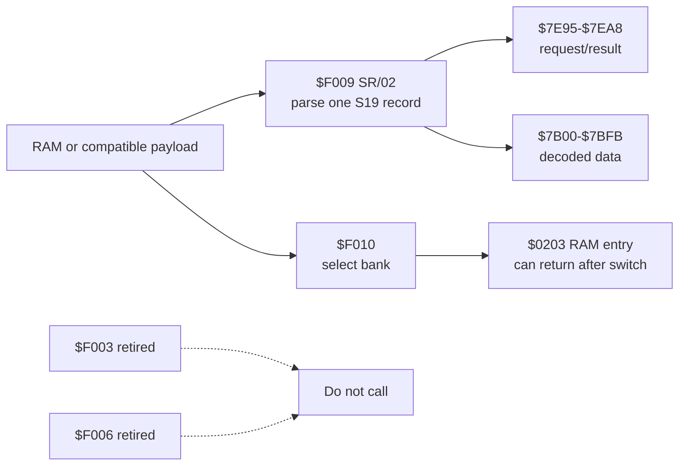

# STR8-N V2 Maps and Diagrams

These diagrams describe the current V2 implementation.

## Ownership



## Physical flash to CPU view

```text
physical flash       bank     CPU view
$00000-$07FFF        0        $8000-$FFFF
$08000-$0FFFF        1        $8000-$FFFF
$10000-$17FFF        2        $8000-$FFFF
$18000-$1EFFF        3        $8000-$EFFF payload
$1F000-$1FFFF        3        $F000-$FFFF protected STR8-N
```



## Boot and handoff



## Install transaction



## Protected 4K top sector

```text
$FFFF  +------------------------------+
       | hardware vectors       6 B   |
$FFF9  +------------------------------+
       | configuration         10 B   |
$FFEF  +------------------------------+
       | bank directory        64 B   |
$FFAF  +------------------------------+
       | stored worker        596 B   |
$FD5B  +------------------------------+
       | free margin           38 B   |
$FD35  +------------------------------+
       | resident code       3382 B   |
$F000  +------------------------------+
```

## Legal top-aligned install sizes

```text
Banks 0-2, ending at $FFFF       Bank 3, ending below STR8-N
 4K  F    $F000-$FFFF            4K  E    $E000-$EFFF
 8K  E-F  $E000-$FFFF            8K  D-E  $D000-$EFFF
12K  D-F  $D000-$FFFF           12K  C-E  $C000-$EFFF
16K  C-F  $C000-$FFFF           16K  B-E  $B000-$EFFF
20K  B-F  $B000-$FFFF           20K  A-E  $A000-$EFFF
24K  A-F  $A000-$FFFF           24K  9-E  $9000-$EFFF
28K  9-F  $9000-$FFFF           28K  8-E  $8000-$EFFF
32K  8-F  $8000-$FFFF
```

These are useful top-aligned examples, not a restriction. Any contiguous
sector span inside `8-F` (Banks 0-2) or `8-E` (Bank 3) is accepted. `I` always
writes flash. HIMON `L`/`L G` owns RAM loading.

## Flash install versus RAM load



## Transient RAM during install

```text
$1FFF  +------------------------------+
       | update state $1FE9-$1FFF     |
$1FE8  +------------------------------+
       | other RAM                    |
$19FF  +------------------------------+
       | 4K sector tray $0A00-$19FF  |
$09FF  +------------------------------+
       | other RAM                    |
$0453  +------------------------------+
       | worker $0200-$0453           |
$01FF  +------------------------------+
       | stack                        |
$00FF  +------------------------------+
       | state and ZP scratch         |
$0000  +------------------------------+
```

## Supported interfaces


