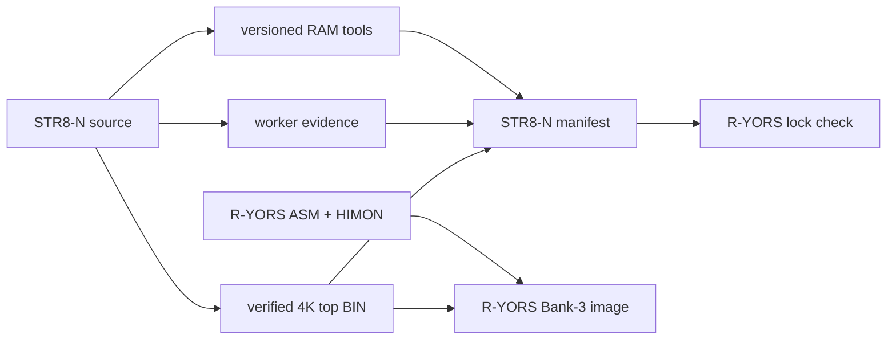

# R-YORS Integration Boundary

Configuration update (2026-09-16): no flash WORK (`$FFF0=$FF`),
protected backup B2:F (`$FFF1=$2F`). Installed on COM4 with guarded ordinary updater and exact four-bank readback;
physical reset and final four-bank isolation pass. See
[role-update evidence](STR8N_V1_34_SECTOR_ROLE_BOARD_TEST_2026-09-16.md).
Earlier B1:E/B1:F hardware evidence remains specific to its original images.

Later workbench smoke on 2026-09-16 installed scoped HIMON/AM02 and live
`$FFF2=$A6` through a separately guarded RAM policy updater. Physical reset
and final four-bank isolation pass; canonical release defaults remain `$FF`.
See the [R-YORS smoke record](../../R-YORS/DOC/GUIDES/LOGS/SCOPED_SMOKE_BOARD_2026-09-16.md).
The [banked AP qualification](../../R-YORS/DOC/GUIDES/LOGS/SCOPED_QUALIFICATION_2026-09-16.md)
now passes BANKDUMP, malformed/duplicate refusal, role predicates, paced LED/PCR
observation, reset and final isolation. BANKDUMP is retained at B2:A; B1:A is
erased. Expected B1 directory enrollment and installer journal updates remain.
RAM-provider/HREC search is still open.
See the [role migration sequence](../../R-YORS/DOC/GUIDES/AP/SECTOR_ROLES_AND_RAM_TRANSIENTS_2026-09-16.md).

STR8-N owns its resident source, embedded worker, payload tools, protected 4K
layout, directory rules, and public ABI. R-YORS consumes verified artifacts;
it must not maintain a second live STR8-N source tree.

The current v1.34 release changes the packed worker address and the
linked interrupt targets. Consumers must refresh their content lock and
generated contract; public service entries and RAM ownership stay fixed.
See [the size-change report](STR8N_V1_34_SIZE_OPTIMIZATION.md) for validation
and the exact board coverage and remaining hardware matrix.

## Normal two-folder workspace

```text
parent/
  R-YORS/
  STR8-N/
```

`STR8N_HOME` may point at a differently located STR8-N checkout:

```text
make -C SRC str8n-external-check
make all STR8N_HOME="C:/path/to/STR8-N"
```

A release build must match the R-YORS content lock and use a clean STR8-N
worktree. The lock binds the top-sector and public-contract hashes; docs-only
STR8-N commits do not require lock churn.

## Published STR8-N artifacts

```text
BUILD/v1.34/bin/str8n-v1.34-bank3-f000-ffff.bin
BUILD/v1.34/s19/str8n-v1.34-f000.s19
BUILD/v1.34/s19/str8n-v1.34-worker-0200.s19
BUILD/v1.34/s19/str8n-v1.34-bank-maint-2000.s19
BUILD/v1.34/s19/str8n-v1.34-console-abi-test-2000.s19
BUILD/v1.34/s19/str8n-v1.34-top-update-2000.s19
BUILD/v1.34/s19/str8n-v1.34-directory-refresh-2000.s19
BUILD/v1.34/s19/str8n-v1.34-wdcmonv2-archive-2000.s19
BUILD/v1.34/s19/str8n-v1.34-wdcmonv2-install-2000.s19
BUILD/v1.34/include/str8n-public.inc
BUILD/str8n-manifest.json
```

The manifest publishes the top-sector and worker layout, hashes, public ABI,
record service version/capabilities, and hashes for every maintained RAM tool.
Bank Maintenance loads at `$2000-$39B2`, keeps its private worker at
`$3400-$362A`, and offers map, copy+directory, adopt, reclaim, rename, erase,
AP operations, and protected-top maintenance.
The directory-refresh image preserves a verified copy in Bank 2 sector F
before clearing Bank 3 `$FFB0-$FFEF`; it then installs `$FFF0=$FF` for no flash
WORK, `$FFF1=$2F` for the protected B2:F B3:F backup, and leaves
`$FFF2-$FFF9` erased. The public contract now exports
`STR8_CONFIG_FNV_POLICY=$FFF2` and `STR8_CONFIG_FNV_DEFAULT=$FF`; manifest layout
records those values and reserves `$FFF3-$FFF9`. The new sector-role defaults change both top and public-contract hashes.
The role migration and FNV policy enrollment remain separate board gates. The
R-YORS lock binds the core top-sector/public-contract content needed by its build.
R-YORS verifies the locked values, resident ABI gates, fixed service
addresses, vectors, and protected layout before constructing Bank 3.



## Bank-3 ownership

```text
$8000-$BFFF  ASM-F2, built by R-YORS
$C000-$EFFF  HIMON, built by R-YORS
$F000-$FFFF  STR8-N, verified external 4096-byte BIN
```

R-YORS code binds only to interfaces listed in the
[Technical Guide](TECHNICAL_GUIDE.md#resident-callable-abi). Its Banked-AP helper
runs at `$0300` after the STR8-N selector prefix at `$0200-$0226`; it shares
the larger `$0200-$0437` worker tray rather than coexisting with the complete
mutation worker. The R-YORS build must reject overlap with the selector prefix
if that contract moves.

`$F003` initializes the raw console and `$F006` reports resident ABI version
and capabilities. Record parsing is `$F009` ABI V2. Bank select is `$F010`,
with its return-capable RAM entry at `$0203`. Worker mode 6 is not an
interface.

## R-YORS files consumed by STR8-N tools

The reverse dependency is limited to the optional full-bank image builder:

```text
R-YORS/RELEASE/ryors-v1.2-himon-asm-bank3-8-e.s19
                         28K dense payload, $8000-$EFFF, S9 $C000
STR8-N BUILD/v1.34/bin/str8n-v1.34-bank3-f000-ffff.bin
                          4K current top, $F000-$FFFF
                                      |
                                      v
R-YORS RELEASE/ryors-v1.2-str8n-himon-asm-bank0-2-8-f.s19
                         32K dense payload, $8000-$FFFF, S9/RESET $F000
```

Run `make ryors-full-bank`. The builder validates every byte and checksum in
the R-YORS 28K S19, appends the current STR8-N BIN, verifies RESET, and emits
a new dense S19. It deliberately does not reuse a stale STR8-N top sector from
an older combined R-YORS binary.

The `8-F` output is for Banks 0-2. Bank 3 sector F remains externally
programmed and protected from `I`.

## RAM-loader boundary

STR8-N `L` is an operator recovery command, not a public callable ABI. It
loads S1 data only in `$2000-$7AFF` and immediately executes an in-range S9.
The supplied bank-maintenance S19 uses that path and is independent of HIMON.

HIMON bare `L` is a separate R-YORS user interface over this repository's
public `$F009` `SR/02` parser. STR8-N validates and decodes S0/S1/S9; HIMON
applies its own RAM destination/copy/session policy and reports S9 without
executing it. `L G` and `L F` are rejected. A missing, damaged, or
incompatible STR8-N service makes HIMON `L` fail closed before receive.

## Hardware acceptance

The current integrated acceptance is STR8-N `1.29` with HIMON/ASM-F2
`00.0902(1707)`. On 2026-09-02 the Bank-3 C-E update and the HIMON bare-`L`
matrix passed on COM4, including the direct `$F009` call-site/provenance gate,
positive S19 load, protected span, malformed/checksum failure, `L G`/`L F`
rejection, and physical-reset return through STR8-N.

The following 2026-08-13 record is retained as historical ownership-cutover
evidence; its versions and loader internals are not current instructions.

On 2026-08-13 the separated build installed the exact R-YORS 28K Bank-3
`8-E` payload through STR8-N 1.2. One initial transfer failed before any
sector-progress dot; an immediate retry programmed all seven sectors and
committed `OK`. Physical RESET then cold-booted HIMON `00.0813(0552)`, entered
and exited ASM-F2 `00.0813(0552)`, and a final RESET/live-`S` selection
returned to STR8-N. Sector F was not rewritten. The exact append-only terminal
evidence is retained in sibling R-YORS at
`DOC/GUIDES/LOGS/HARDWARE_TEST_LOG.md`.

The continuation loaded the standalone `$2000-$362A` Bank Maintenance image
through HIMON bare `L`, started it with explicit `G 2000`, copied all eight
Bank-3 sectors to Bank 0 behind the exact `COPY 30` guard, and enrolled
`D0 FF COPY1 FFFF FCFFFFFF`. STR8-N's own `L` then loaded and directly ran the
maintenance image; its map showed the Bank-0 copy and D0 enrollment persisted.
A final RESET still cold-booted HIMON. The complete transcript and bounded
claims are retained in
[R_YORS_OWNERSHIP_CUTOVER_HARDWARE_PROOF_2026-08-13.md](R_YORS_OWNERSHIP_CUTOVER_HARDWARE_PROOF_2026-08-13.md).
