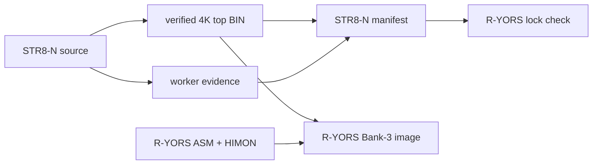

# R-YORS Integration Boundary

STR8-N owns its resident source, embedded worker, payload tools, protected 4K
layout, directory rules, and public ABI. R-YORS consumes verified artifacts;
it must not maintain a second live STR8-N source tree.

## Normal two-folder workspace

```text
parent/
  R-YORS/
  STR8-N Refactor/
```

`STR8N_HOME` may point at a differently located STR8-N checkout:

```text
make -C SRC str8n-external-check
make all STR8N_HOME="C:/path/to/STR8-N Refactor"
```

A release build should use the exact locked STR8-N commit and a clean STR8-N
worktree.

## Published STR8-N artifacts

```text
BUILD/v1.2/bin/str8n-bank3-f000-ffff.bin
BUILD/v1.2/s19/str8n-worker-0200.s19
BUILD/v1.2/s19/str8n-v1.2-bank-maint-2000.s19
BUILD/str8n-manifest.json
```

The manifest publishes the top-sector and worker layout, hashes, fixed ABI,
record service version/capabilities, and the bank-maintenance image hash. The
R-YORS lock binds the core top-sector/worker contract needed by its build.
R-YORS verifies the locked values, resident ABI gates, fixed service
addresses, vectors, and protected layout before constructing Bank 3.



## Bank-3 ownership

```text
$8000-$BFFF  ASM-F2, built by R-YORS
$C000-$EFFF  HIMON, built by R-YORS
$F000-$FFFF  STR8-N, verified external 4096-byte BIN
```

R-YORS code binds only to interfaces listed in the
[Technical Guide](TECHNICAL_GUIDE.md#public-interface). Its Banked-AP helper
starts at `$0500`, above STR8-N's complete relocated worker at
`$0200-$0453`; the R-YORS build must reject an overlap if that contract moves.

`$F003` initializes the raw console and `$F006` reports resident ABI version
and capabilities. Record parsing is `$F009` ABI V2. Bank select is `$F010`,
with its return-capable RAM entry at `$0203`. Worker mode 6 is not an
interface.

## R-YORS files consumed by STR8-N tools

The reverse dependency is limited to the optional full-bank image builder:

```text
R-YORS/SRC/BUILD/s19/ryors-v1.2-asm-himon-bank3-8-e.s19
                         28K dense payload, $8000-$EFFF, S9 $C000
STR8-N BUILD/v1.2/bin/str8n-bank3-f000-ffff.bin
                          4K current top, $F000-$FFFF
                                      |
                                      v
STR8-N BUILD/v1.2/s19/ryors-v1.2-asm-himon-str8n-bank0-2-8-f.s19
                         32K dense payload, $8000-$FFFF, S9/RESET $F000
```

Run `make ryors-full-bank`. The builder validates every byte and checksum in
the R-YORS 28K S19, appends the current STR8-N BIN, verifies RESET, and emits
a new dense S19. It deliberately does not reuse a stale STR8-N top sector from
an older combined R-YORS binary.

The `8-F` output is for Banks 0-2. Bank 3 sector F remains externally
programmed and protected from `I`.

## RAM-loader boundary

STR8-N `L` is an operator recovery command, not a public callable ABI. It
loads S1 data only in `$2000-$7AFF` and immediately executes an in-range S9.
The supplied bank-maintenance S19 uses that path and is independent of HIMON.

HIMON `L` and `L G` are R-YORS features. They call STR8-N `$F009` for record
syntax/checksum parsing, then apply HIMON's own destination, load-only, and
start-address policies.
