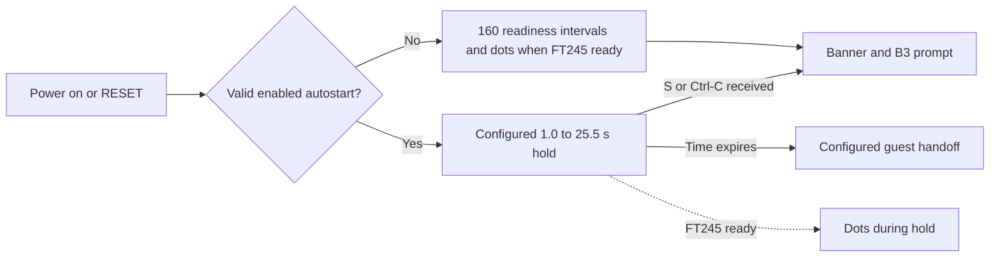

# STR8-N 2.0a22 operator's guide

This guide describes the dot-enabled 2.0a22 **Bank 3 resident monitor plus
optional Bank 3 E-sector S/R/T extension**. The installed candidate was
regression-tested on a W65C02SXB + EDU Kit at 8 MHz with FT245 on COM3.
The [quickstart](STR8N_V2_A22_QUICKSTART.md) is the short workflow; the
[technical manual](STR8N_V2_A22_TECHNICAL_MANUAL.md) contains address maps and
call contracts. The v1.35 operator guide applies to v1.35, not this image.

## Console, startup, and bank selection

The FT245 USB console on the tested board was opened at 115200 baud. `B3>`
means Bank 3 is the **selected monitor access bank**. `B0`-`B3` change that
selection without executing code. Bank 3 remains the resident monitor on the
tested layout. `C` shows the configuration, `?` shows help. Numeric addresses,
bytes, and delays use hex; bank operands use `0`-`3`.



The enabled hold countdown does not wait for USB enumeration and does not use
ACIA as a parallel input path. It probes FT245 once each tenth-second tick and
prints a dot only if transmission is ready. The disabled-autostart monitor
path probes over 160 short intervals (about 6.58 seconds at 8 MHz) and prints
dots after FT245 becomes ready. A short enabled hold can expire before the USB
host opens the port, so dots and the hold key may be unavailable to that host
even though guest startup succeeds. ACIA receive remains unqualified.

On the tested board, `C 00 00 V 0A` was the configuration after regression;
a physical RESET printed 160 dots and returned to `B3>`. An earlier enabled
`$99` hold printed 148 dots and launched the Bank 0 guest after USB power
off/on with no RESET pressed. These are [recorded board results](STR8N_V2_A22_REGRESSION_2026-09-26.md),
not a promise about another host's enumeration time.

## Command reference

| Command | Effect and boundary |
| --- | --- |
| `?` | Show monitor help. |
| `B0`-`B3` | Select flash bank for monitor access; no execution. |
| `D addr [end]` | Display a byte or inclusive range in the selected mapping. |
| `M addr bytes...` | Modify allowed RAM; monitor workspace is protected. |
| `F addr bytes...` | Edit flash bytes in one 4 KiB sector, with preview and confirmation. Bank 3 E is protected from ordinary `F`. |
| `G addr` | Hand off to code at an address in the selected mapping; no return contract. |
| `L` | Receive S19 into permitted RAM; load only. |
| `I start end` | Install dense ascending S19 into whole, aligned flash sectors; both endpoints inclusive. Bank 3 E/F are protected. |
| `C` | Show resident autostart configuration. |
| `C 0|1 bank addr|V delay` | Disable/enable autostart and choose fixed address or RESET vector; delay `$0A-$FF` tenths. Preview and confirm E-sector rewrite. |
| `J0`-`J3` | Boot a bank through its RESET vector; no return contract. `J3` restarts the resident monitor on the tested layout. |
| `S bank flash ram-start ram-end [label]` | Save an inclusive RAM range to an explicit erased record-sized flash span. |
| `R bank flash` | Restore one complete record to its recorded RAM address; does not run it. |
| `T bank` | List recognized save records in a bank. |

If the `$E800` descriptor is absent or incompatible, `S`, `R`, and `T` report
`SR unavailable`. `S` and `R` successes report `Done`; `T` prints rows and
returns to the prompt. Syntax errors may report `Bad hex`. Ctrl-C cancels at
safe command boundaries; a flash mutation already in progress completes its
current worker operation before cancellation is honored.

## Save and restore procedure

1. Choose a destination bank and explicit flash address between `$8000` and
   `$DFFF`. The full **24-byte header plus RAM payload** must end by `$DFFF`.
   Crossing a 4 KiB boundary is supported. A sector does not have to be wholly
   erased: every byte of the proposed record span must be `$FF`, including the
   header. Neighboring programmed bytes are preserved.
2. Keep the source RAM range inside `$0200-$68FF`. `T <bank>` shows recognized
   records. Check your intended location; `S` independently rejects any
   occupied byte before its first write. `T` cannot prove an unlisted span is
   erased, because arbitrary programmed bytes may not form a record.
3. Enter `S <bank> <flash> <start> <inclusive-end> [label]`. The optional label
   is 1-16 printable non-space ASCII characters. Wait for `Done` and use
   `T <bank>` to confirm a row marked `C`.
4. Before `R`, ensure the original RAM destination can be overwritten. `R`
   validates the complete header and copies the payload to the stored RAM
   address. It never executes the restored bytes. Inspect with `D`, then use
   `G` only if that code's own entry and environment are known.

Example shape, **only when the proposed span is erased**:

```text
S 3 9000 2000 201F MYAPP
T 3
R 3 9000
D 2000 201F
```

The tested board's existing row is `8FF0 2000-2003 0004 C TEST`: flash start,
original RAM range, payload length, state, label. `P` means a pending save;
`R` refuses it. `T` scans the bank, validates candidate metadata, skips a
valid record's full extent, and advances one byte after an invalid candidate.
It may show a valid pending header. There is no name lookup, automatic
placement, automatic reclamation, or payload checksum in a22. Save verifies
flash programming at write time; later payload corruption is not detected.

| `SR error` | Meaning | Next operator action |
| --- | --- | --- |
| `01` | Invalid bank, address, RAM range, extent, or label | Correct the arguments; keep record inside `$8000-$DFFF`. |
| `02` | At least one proposed record byte is programmed | Choose a known erased span; do not overwrite the existing record. |
| `03` | Flash program or verification failed | Read back the area and preserve the remaining data before retrying elsewhere. |
| `04` | Record is missing, invalid, or incomplete | Use `T` and readback to find a complete record. |

## Configuration and flash updates

`C 1 0 V 0A` sets Bank 0 RESET-vector autostart after a nominal one-second
hold. `C 1 0 8000 0A` uses a fixed `$8000` entry. `C 0 0 V 0A` disables
autostart. `V` resolves the target bank's RESET vector at handoff. The monitor
checks the vector address, not the guest program. An erased or invalid
configuration stays at the monitor. `C` snapshots the complete Bank 3 E
sector, changes the 16-byte pocket at `$EFF0-$EFFF`, and verifies the rewrite
through its RAM worker; keep board power stable until `Done`.

`I` uses complete 4 KiB sectors; this **does not restrict S/R records**.
`F` edits selected bytes in one sector and may erase/rewrite the sector when
0-to-1 bit changes are needed. Ordinary Bank 3 `F` and `I` reject the E
sector to protect S/R/T and configuration. `I` also protects Bank 3 F.
Resident F editing carries a separate confirmation and recovery path.

E and F are a **matched build**: the extension calls private F addresses that
can move when F is relinked. Install or repair both using artifacts made for
the exact current board image; preserve configuration and verify readback.
The [installation report](STR8N_V2_A22_COM3_INSTALL_2026-09-26.md) records the
COM3 E-first/F-second update and the Bank 2 F-sector backup. A raw dense E/F
image would replace live configuration bytes. The two writes are not atomic.

The a22 command set is a recovery and boot-loader interface. It does not
manage guest images, validate their payloads at boot, or provide a directory.
