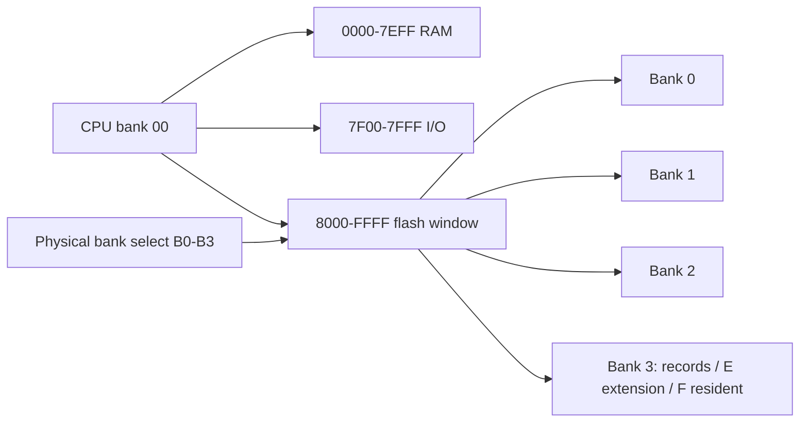
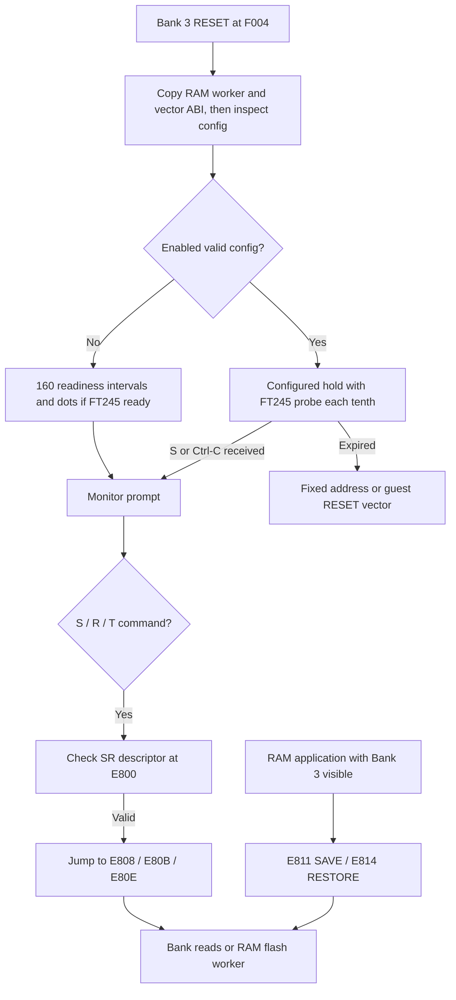
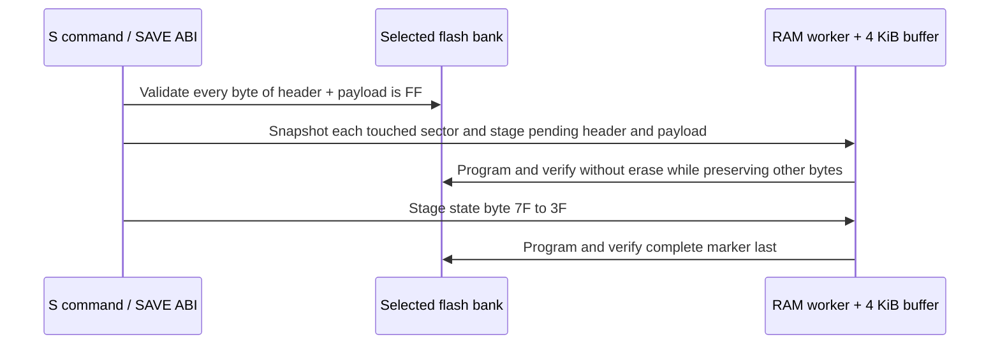

# STR8-N 2.0a22 technical manual

This is the address, size, and call contract for the **dot-enabled 2.0a22
Bank 3 E/F pair**. It supplements the
[operator's guide](STR8N_V2_A22_OPERATORS_GUIDE.md) and
[quickstart](STR8N_V2_A22_QUICKSTART.md). Addresses below are CPU bank `$00`
addresses on a W65C816; B0-B3 are **physical flash overlays**, not 816 banks.
The measured sizes come from [`build.json`](../BUILD/v2-alpha22/build.json)
and the public constants from
[`str8n-v2-public.inc`](../src/v2a22/str8n-v2-public.inc).

## Build identity and occupancy

| Region | Built use | Reservation | Free in reservation |
| --- | ---: | ---: | ---: |
| Bank 3 F resident code | 4,064 bytes, `$F000-$FFDF` | `$F000-$FFDF` | 0 bytes |
| Bank 3 hardware vectors | 32 bytes, `$FFE0-$FFFF` | `$FFE0-$FFFF` | 0 bytes |
| Bank 3 E extension code | 1,208 bytes, `$E800-$ECB7` | `$E800-$EEFF` (1,792 bytes) | 584 bytes, `$ECB8-$EEFF` |
| RAM worker | 759 bytes, `$7900-$7BF6` | `$7900-$7BFF` (768 bytes) | 9 bytes |
| RAM vector/public code | 196 bytes, `$7E20-$7EE3` | `$7E20-$7EFF` (224 bytes) | 28 bytes |

```text
Reserved code space used (20-character bars, rounded)
F resident   [####################] 4064 / 4064  = 100.0%
E extension  [#############.......] 1208 / 1792  =  67.4%
RAM worker   [####################]  759 /  768  =  98.8%
```

F has no expansion bytes before the vectors in this build. The 16-byte
configuration pocket is at `$EFF0-$EFFF` in E and is separate from the E code
reservation. The tested F code SHA-256 is
`1bae74704dd5c66ca34fa8d3b1bdfa9f2cf65ffab72a724a8eba87888420a439`;
the `$E800-$EEFF` code reservation SHA-256 is
`fcb0a253fa802c5e44ce48bba22c4b004a49b6dfe8b6563a9d8891ea75875401`.
Hashes describe the code regions, not a live E sector whose configuration
may change.

## Address maps

| CPU address | Size | Owner/use |
| --- | ---: | --- |
| `$0000-$00DF` | 224 B | Application zero page. |
| `$00E0-$00FF` | 32 B | Monitor scratch and bank/console state. |
| `$0100-$01FF` | 256 B | CPU stack; contents are not preserved at handoff. |
| `$0200-$68FF` | 26,368 B | Application RAM and legal S/R source/destination range. |
| `$6900-$78FF` | 4,096 B | Shared full-sector staging buffer for flash operations. |
| `$7900-$7BFF` | 768 B | RAM worker reservation; built code ends `$7BF6`. |
| `$7C00-$7CFF` | 256 B | Line and command/S19 buffers; line limit 40 chars. |
| `$7D00-$7DFF` | 256 B | Monitor state/queue/config; S/R private scratch `$7D90-$7DCA`. |
| `$7E00-$7E1F` | 32 B | Emulation and native handler pointers. |
| `$7E20-$7EE3` | 196 B | RAM interrupt code and public RAM ABI. |
| `$7EE4-$7EFF` | 28 B | Reserved RAM. |
| `$7F00-$7FFF` | 256 B | Board I/O. |
| `$8000-$FFFF` | 32 KiB | Window onto selected physical flash bank B0-B3. |

| Bank 3 flash address | Use |
| --- | --- |
| `$8000-$DFFF` | S/R record storage allowed; 24,576 bytes total, maximum one payload 24,552 bytes. Guest or other flash content may also occupy this space. |
| `$E000-$E7FF` | Erased in this candidate; reserved for later utilities. |
| `$E800-$ECB7` | Built S/R/T extension and its descriptor/call slots. |
| `$ECB8-$EEFF` | Unused extension reservation, 584 bytes. |
| `$EF00-$EFEF` | Reserved; preserve on E-sector updates. |
| `$EFF0-$EFFF` | Resident autostart configuration, 16 bytes. |
| `$F000-$FFDF` | Resident monitor code and public ROM facade. |
| `$FFE0-$FFFF` | Hardware vectors. |



Ordinary `I` uses inclusive complete 4 KiB sectors and protects Bank 3 E/F.
Ordinary Bank 3 `F` rejects E; resident F edits have a separate guarded path.
`C` alone updates the configuration pocket by staging the entire E sector.
`S` uses only `$8000-$DFFF`, accepts a byte start and sector crossings, and
requires just its **header plus payload extent** to be erased. It stages every
touched sector in the 4 KiB buffer, preserves bytes outside the record,
programs/verifies through the existing RAM worker without erase, and commits
the complete marker last. It never calls the worker as a public API.

## Startup and call graph



The reset path does not execute E. If the E descriptor is absent or has the
wrong ABI, the monitor still boots and reports `SR unavailable` for S/R/T.
The monitor uses a private, build-coupled interface between E and F; **E and
F must be installed as a matched pair** after a relink. The fixed public
entries below are the interfaces applications may use.

## Fixed core entries and call sites

The ROM signature at `$F000-$F003` is `SN 02 00`. Each following slot is a
three-byte absolute `JMP`. Calls through F require the resident Bank 3 flash
overlay visible. For applications running with any other flash bank visible,
use the initialized RAM table after verifying `RA 01 0D` at `$7E60`.

| Service | F entry (Bank 3 visible) | RAM entry (any bank visible) | Contract summary |
| --- | --- | --- | --- |
| RESET | `$F004` | `$7E64` | Reset-style monitor entry; no return. |
| HOLD | `$F007` | `$7E67` | Enter monitor prompt, bypass autostart; no return. |
| CON_INIT | `$F00A` | `$7E6A` | Resample/select console; returning. |
| PUTC | `$F00D` | `$7E6D` | Output A; preserves A/X/Y. |
| GETC | `$F010` | `$7E70` | Buffered blocking input in A; Ctrl-C is `$03`. |
| RAW_POLL | `$F013` | `$7E73` | Hardware-only poll; C=1/A=byte, C=0 empty. |
| CHECK_CANCEL | `$F016` | `$7E76` | Service input; C=1 if cancel pending. |
| RX_RESET | `$F019` | `$7E79` | Clear software input/error/cancel state. |
| HEX_OUT | `$F01F` | `$7E7C` | Print A as two hex digits. |
| NEWLINE | `$F022` | `$7E7F` | Print CR/LF. |
| HEX_NIBBLE | `$F025` | `$7E82` | ASCII A to nibble; C=1/A=0-15 valid. |
| CAPS_QUERY | `$F028` | `$7E85` | A=format, X=flags, Y=length, C=1. |
| BOARD_QUERY | `$F02B` | `$7E88` | A=format, X=CPU, Y=board/console flags, C=1. |

F slot `$F01C` is reserved for line input. `$F02E` and `$F031` are reserved;
do not call them as services. The four-byte capability descriptor at `$F035`
is `CA 01 17`: 65C02, 816 emulation, native vectors, and bank-independent
RAM calls advertised; native-mode monitor calls are not advertised.
`BOARD_QUERY` reports X=`$02` for 65C02 or `$16` for 65C816; Y contains
board/console flags. The RAM ABI comprises 13 three-byte slots
`$7E64-$7E8A`. It requires monitor startup to have copied and initialized
its RAM code. Returning entries retain the caller's visible flash bank.

| Caller location | Visible overlay at call | Call site to use |
| --- | --- | --- |
| Bank 3 code or RAM with Bank 3 visible | Bank 3 | Core F facade or RAM ABI; S/R application calls `$E811`/`$E814`. |
| Guest code in B0-B2 | Its own bank | Core RAM ABI. To call S/R, first hand off to RAM code that safely makes Bank 3 visible, then call E. |
| RAM code while any bank is visible | Any | Core RAM ABI; S/R E calls require Bank 3 visible. |

All calls require IRQ disabled and decimal mode clear. On 816 they require
emulation mode, direct page `$0000`, DBR=0, and PBR=0. Calls are not reentrant;
registers/flags not named as results or preserved are unspecified. The RAM
interrupt-pointer pairs are `$7E00-$7E09` (emulation) and `$7E10-$7E19`
(native); the NMI publication gate is `$00F4`. Applications must preserve
monitor-owned RAM. W65C816 physical hardware was not available in this a22
regression.

## S/R extension ABI

`$E800-$E807` holds an eight-byte descriptor:

| Offset | Bytes | Meaning |
| --- | --- | --- |
| 0-1 | `53 52` | ASCII `SR` signature. |
| 2 | `01` | Extension ABI version. |
| 3 | `01` | Feature byte for this implementation. |
| 4 | `18` | Record header size, 24 bytes. |
| 5-7 | `00 00 00` | Reserved. |

| Entry | Slot size | Call site |
| --- | ---: | --- |
| `$E808` | 3 B JMP | Monitor console `S` dispatcher. |
| `$E80B` | 3 B JMP | Monitor console `R` dispatcher. |
| `$E80E` | 3 B JMP | Monitor console `T` dispatcher. |
| `$E811` | 3 B JMP | Application SAVE. |
| `$E814` | 3 B JMP | Application RESTORE. |

The console slots are for the monitor's parser, **not** application entry
points. Application calls pass A=request pointer low byte, X=high byte. The
request must occupy 23 readable bytes of application RAM, even for RESTORE:

| Request offset | Size | SAVE use | RESTORE use |
| --- | ---: | --- | --- |
| 0 | 1 | Physical bank 0-3 | Physical bank 0-3 |
| 1-2 | 2 | Flash record start, little endian | Flash record start, little endian |
| 3-4 | 2 | RAM start, little endian | Copied, otherwise ignored |
| 5-6 | 2 | Inclusive RAM end, little endian | Copied, otherwise ignored |
| 7-22 | 16 | Printable non-space ASCII label, zero padded | Copied, otherwise ignored |

Success returns C=1 and A=`$00`; failure returns C=0 and A=`$01` (invalid
argument), `$02` (occupied proposed flash extent), `$03` (flash programming
or verify failure), or `$04` (invalid or incomplete record). X/Y and monitor
scratch are clobbered. The selected bank is restored; the physical Bank 3
overlay must be visible on entry and is visible on return. A RESTORE caller
must execute outside the destination RAM range. SAVE copies the request before
flash changes; RESTORE copies it before writing RAM.

```asm
; 65C02 example: this routine executes in RAM with Bank 3 visible.
; IRQ is disabled and decimal mode is clear. Request is in application RAM.
        LDA #<request
        LDX #>request
        JSR $E811          ; SAVE
        BCC save_error     ; A = 01, 02, or 03 on failure
        ; A = 00, carry set
        RTS
save_error:
        RTS               ; handle A in a real application
request:
        DB $03,$00,$90,$00,$20,$1F,$20  ; B3:$9000, RAM $2000-$201F
        DB "MYAPP",0,0,0,0,0,0,0,0,0,0,0
```

The request is 23 bytes and the destination span must be erased before this
illustrative call. Do not call the private RAM flash worker or private E/F
symbols from application code.

## Record and configuration layout

Every S/R record begins at an explicit byte address in `$8000-$DFFF`. Words
are little endian; the payload immediately follows byte 23.

| Record offset | Size | Meaning |
| --- | ---: | --- |
| 0-1 | 2 | ASCII `SR`. |
| 2 | 1 | Record format `$01`. |
| 3 | 1 | `$7F` pending, then `$3F` complete after payload verify. |
| 4-5 | 2 | Original RAM start. |
| 6-7 | 2 | Nonzero payload length, excluding header. |
| 8-23 | 16 | Label, 0-16 printable non-space ASCII chars, zero padded. |
| 24 onward | Length | Exact RAM bytes. No payload checksum in format 1. |



If interrupted before the final state change, a record may be pending or
partially programmed. `R` requires a valid complete header and refuses a
pending record. `T` scans `$8000-$DFFF`, tests signatures and metadata,
advances by the full header+payload extent for a valid record, and otherwise
advances one byte. It can show a `P` row when a pending header has enough
valid metadata. It does not recover or reclaim pending space. There is no
payload integrity check after save-time flash verification.

Resident configuration occupies Bank 3 `$EFF0-$EFFF`:

| Pocket offset | Size | Meaning |
| --- | ---: | --- |
| 0 | 1 | Format `$01`. |
| 1 | 1 | Enable, 0 or 1. |
| 2 | 1 | Target bank, 0-3. |
| 3-4 | 2 | Fixed start address, little endian; zero in vector mode. |
| 5 | 1 | Delay `$0A-$FF` tenths at nominal 8 MHz. |
| 6 | 1 | Mode: 0 fixed address, 1 RESET vector. |
| 7-13 | 7 | Reserved; `C` writes zero. |
| 14-15 | 2 | Two rolling 8-bit integrity sums over offsets 0-13. |

`C` stages all of E before rewriting this pocket; its preservation of E code
was verified on the tested board. Invalid configuration enters the monitor.
The current post-regression board pocket is
`01 00 00 00 00 0A 01 00 00 00 00 00 00 00 0C 70` (disabled, Bank 0,
vector mode, `$0A` delay). This is a board readback, not a required preset.

## Qualification and limits

The [COM3 regression report](STR8N_V2_A22_REGRESSION_2026-09-26.md) records
exact E/F readback, host suites, RAM ABI, S/R/T, BRK/IRQ/NMI, a physical
RESET, and the earlier USB power off/on autostart check. The direct S/R
application ABI was model-tested; no new direct board caller ran in the
regression. ACIA receive, W65C816 hardware, and interrupted flash-write
recovery were not qualified. The candidate source and installation constraints
are in the [S/R/T candidate record](STR8N_V2_A22_SR_CANDIDATE.md).
