# STR8-N 2.0a24c1 detailed technical guide

This guide describes the implemented a24c1 monitor, RAM worker, stock-board
installer, configuration record and bank maintenance.
Mermaid diagrams show control flow and ownership; tables give exact addresses.
Use the [quick start](STR8N_V2_A24C1_QUICK_START.md) for installation and the
[operator manual](STR8N_V2_A24C1_MANUAL.md) for command syntax.

Firmware version is **2.0a24c1**. Maintenance is independently **1.0**.
a24c2 and its RST location byte are proposals, not features of this image.
Use the a24c1 configuration addresses given here.

## System components and ownership

The resident core executes from F in its resident bank. Code that must
continue while banks change or F is being modified executes from RAM.
The console bridge adds colors on the PC; the firmware sends plain bytes.

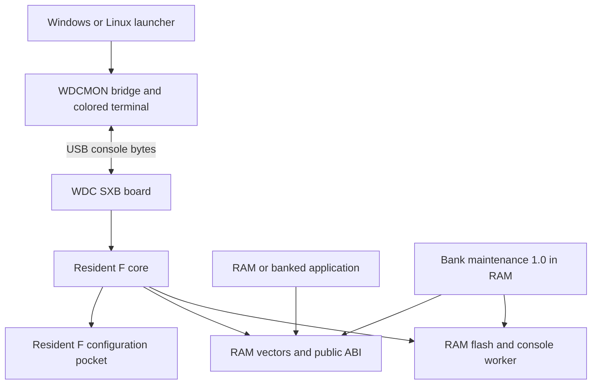

The ROM facade requires the resident flash bank visible. Initialized RAM
entries can be called with another bank selected.

## CPU address space and flash translation

The SST39SF010A provides 128 KiB organized here as four 32 KiB banks.
For flash address A in `$8000-$FFFF`, physical offset is
`bank * $8000 + (A - $8000)`. Sector digits 8 through F name 4 KiB CPU pages.

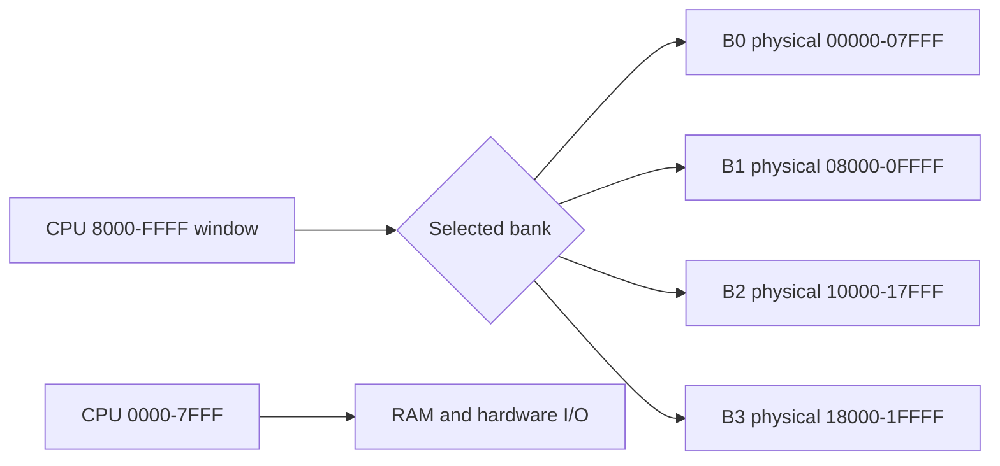

| CPU range | Ownership and restriction |
| --- | --- |
| `$0000-$00DF` | Application zero page |
| `$00E0-$00FF` | Monitor scratch; aliases have command-specific lifetimes |
| `$0100-$01FF` | CPU stack |
| `$0200-$68FF` | Application RAM, 26,368 bytes |
| `$6900-$78FF` | Full 4 KiB desired-sector image |
| `$7900-$7BFF` | Flash/console worker reservation; linked code ends `$7BF6` |
| `$7C00-$7C7F` | Line area; command limit 40 characters |
| `$7C80-$7CFF` | Byte workspace |
| `$7D00-$7D3F` | Monitor state, including resident bank and CPU identity |
| `$7D40-$7D7F` | 64-byte receive queue |
| `$7D80-$7D8F` | RAM configuration copy |
| `$7D90-$7DCA` | Private workspace |
| `$7DCB-$7DFF` | Unassigned in current definitions |
| `$7E00-$7E1F` | Emulation/native interrupt pointer area |
| `$7E20-$7EFF` | Vector code and public RAM facade; linked end `$7EE3` |
| `$7F00-$7FFF` | Hardware I/O address area |
| `$8000-$FFFF` | Selected flash bank |

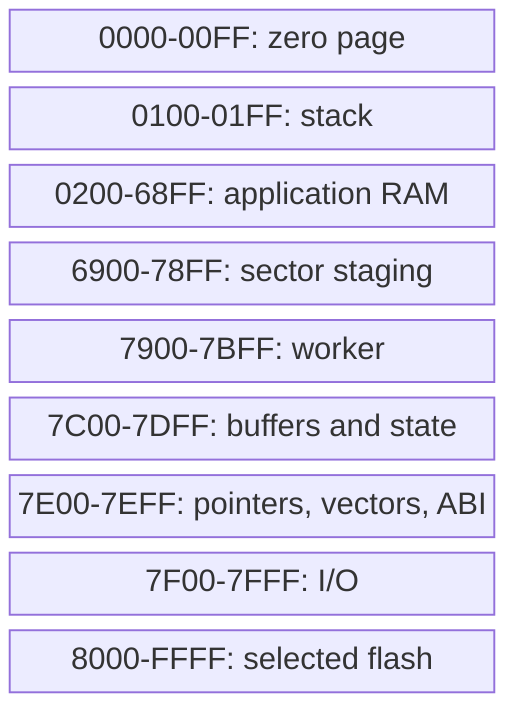

## Resident flash and exact capacity

| Resident-bank range | Contents |
| --- | --- |
| `$F000-$FFBC` | Core and embedded RAM code images, 4,029 bytes |
| `$FFBD-$FFCF` | 19 unused bytes |
| `$FFD0-$FFDF` | 16-byte persistent configuration |
| `$FFE0-$FFFF` | Hardware vectors and reserved words |

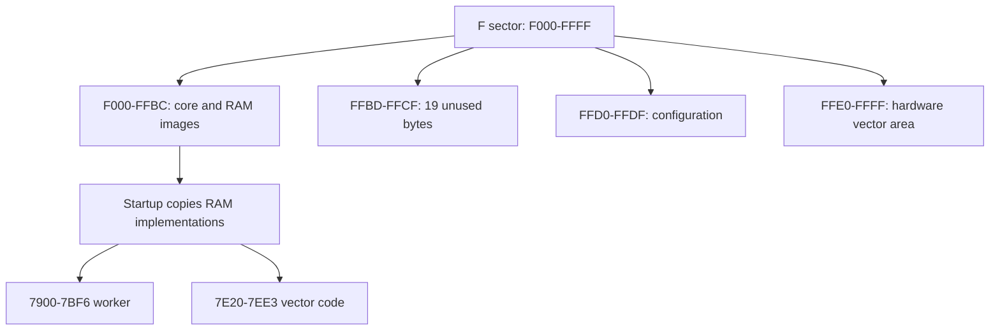

```mermaid
xychart-beta
    title "Linked bytes versus reserved bytes"
    x-axis [Worker, Vectors, CoreBeforeConfig]
    y-axis "Bytes" 0 --> 4096
    bar [759, 196, 4029]
    bar [768, 224, 4048]
```

The first series is linked use; the second is reserved capacity. Free space
is respectively 9, 28 and 19 bytes. The worker image is also stored in
the core image; these counts must not be added as independent flash allocations.

## Startup and reset-only autostart

Reset establishes monitor state and RAM services before normal use. Valid
enabled configuration selects a countdown and guest target. Erased or invalid
configuration holds. USB readiness is probed without making headless autostart
depend on a connected terminal. Delay is nominal tenths at the expected clock.

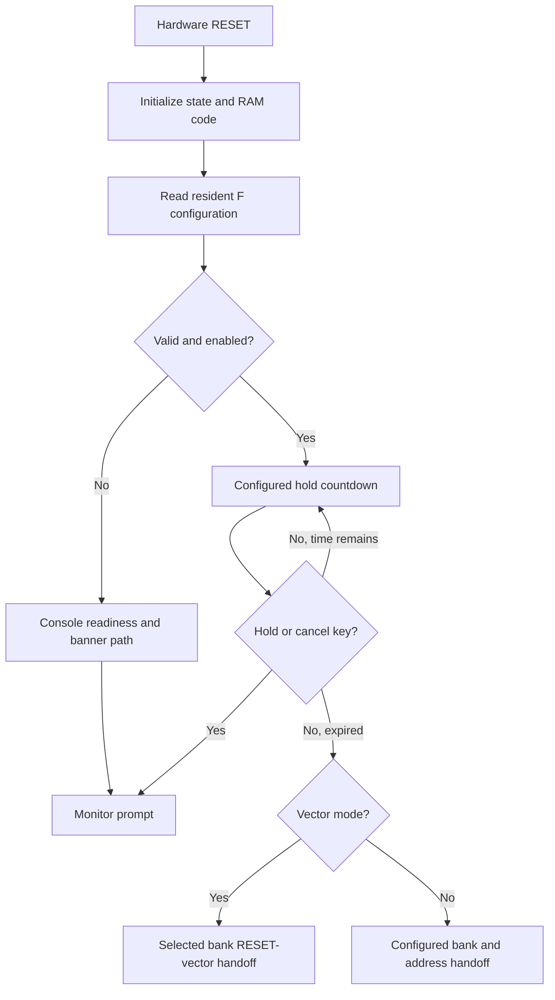

Software HOLD returns to monitor use without repeating reset-only autostart.
J selects and executes a bank's vector; it does not pulse the physical RESET
pin. Guest execution has no return contract.

## Configuration record and checksum flow

| Offset in `$FFD0` record | Meaning |
| --- | --- |
| 0 | Format, currently 1 |
| 1 | Autostart enabled, 0 or 1 |
| 2 | Target bank, 0 through 3 |
| 3-4 | Fixed target address, low byte then high byte |
| 5 | Delay, `$0A-$FF` tenths |
| 6 | Target mode, 0 fixed address or 1 RESET vector |
| 7-13 | C-created records initialize these bytes to zero; included in checksum |
| 14 | Accumulated sum of bytes 0-13 modulo 256 |
| 15 | Accumulated sum of each intermediate first sum modulo 256 |

Validation checks format, enable, bank, delay, mode, the fixed-address
boundary where applicable, and both checksum bytes. Checksums detect many
changes but are not a cryptographic identity check.

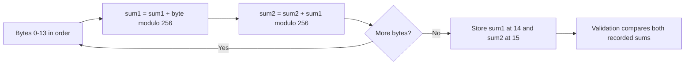

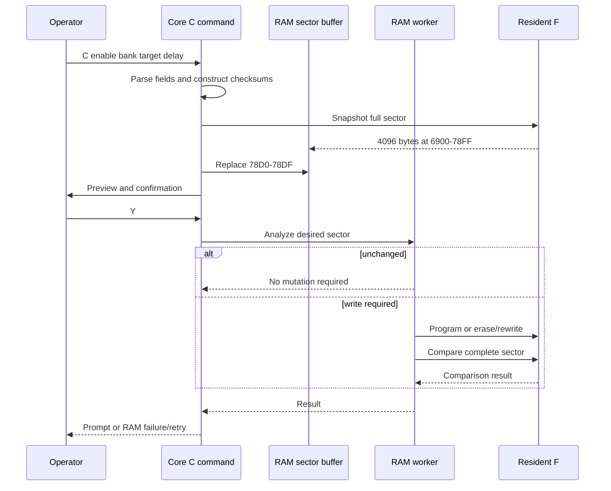

## Flash mutation and failure states

Flash changes require RAM execution while the selected bank or resident F
is unavailable. The staging buffer represents the desired whole sector;
out-of-range bytes are retained where the command promises preservation.

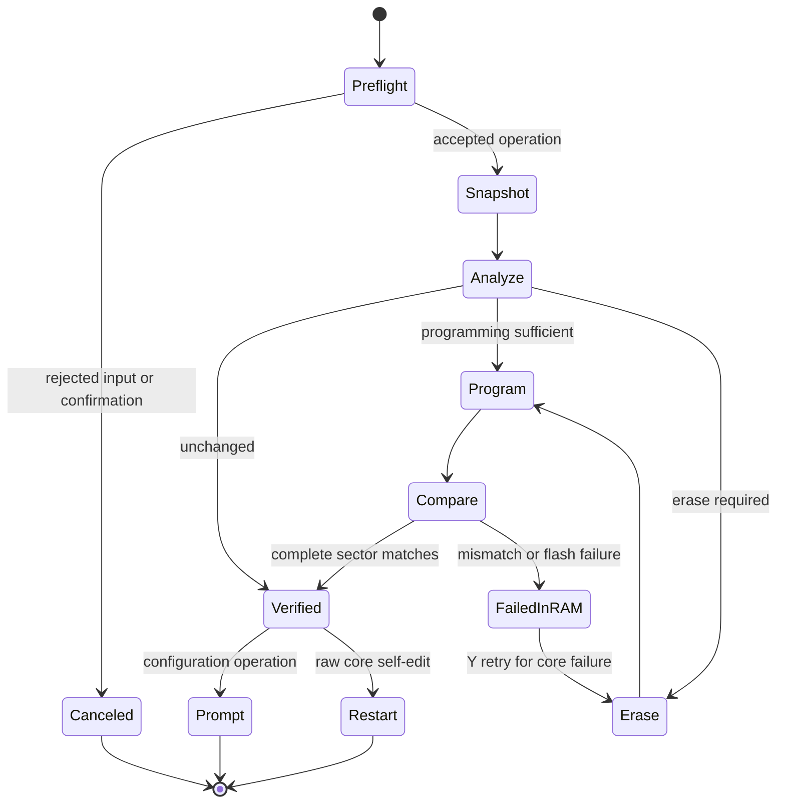

A failed core write remains in RAM. Configuration retry rewrites the complete
staged sector, then returns to the saving command when verified. Raw self-edit
uses restart semantics. Physical NMI/vector fetches, hardware failure and power
loss are not made safe by the RAM retry loop. There is one persistent config copy.

## Stock WDCMON installer gates

The RAM installer is loaded at `$2000`. Its current linked range is
`$2000-$2DB4`, 3,509 bytes; it does not embed the core BIN. The entry uses
SEC, `$FB`, SEI to establish 816 emulation; `$FB` is a one-byte NOP on C02.
Use the manifest to identify the exact build rather than relying on size.

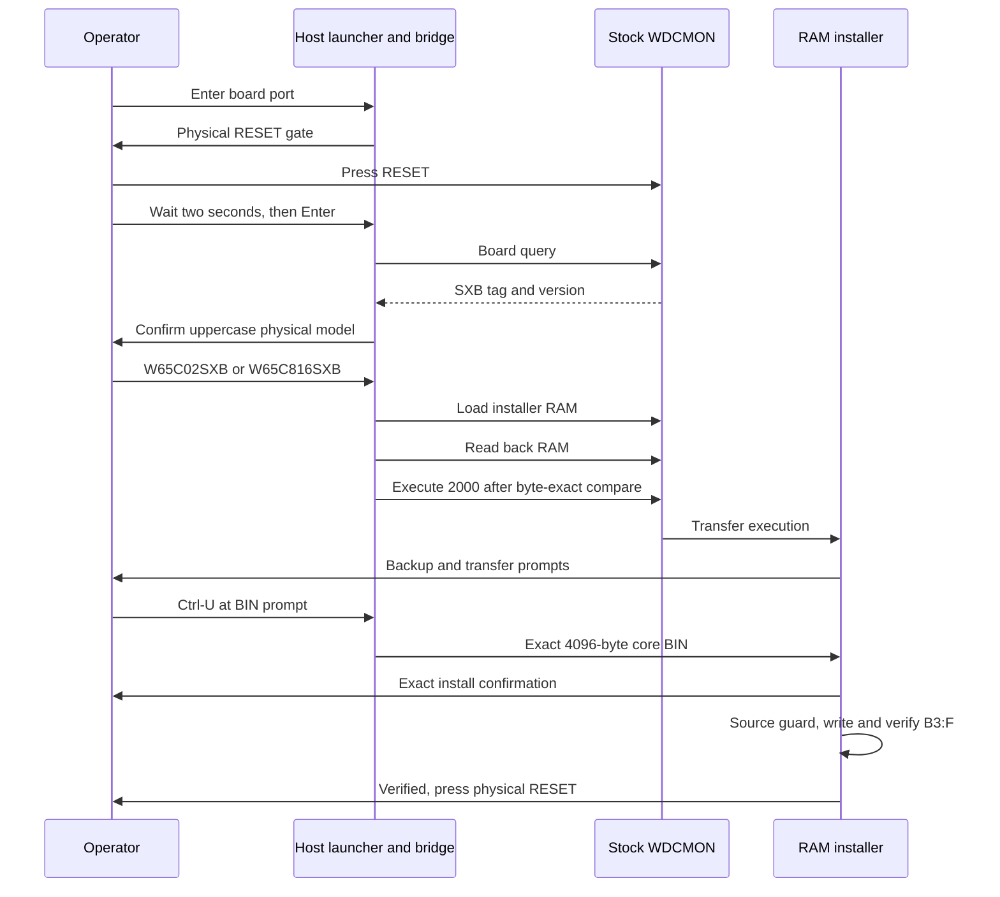

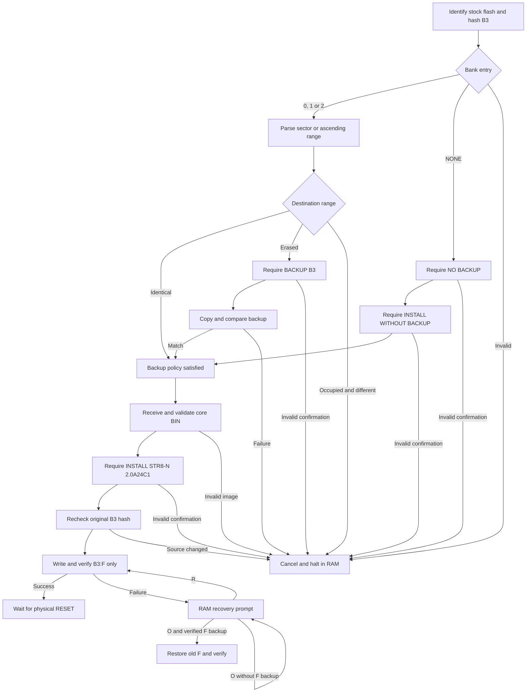

Invalid confirmations halt; neither NONE nor a backup ending before F
provides an old-F restoration source. The source hash guard is an integrity
gate for this process, not cryptographic authentication. No stock-board
installer path should be used as an installed STR8-N updater.

## RAM loading and banked application calls

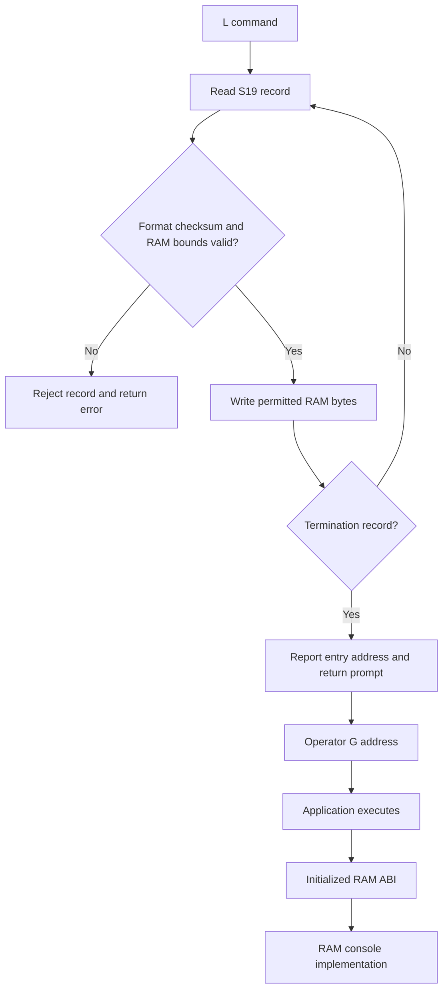

Loading does not execute the S9 entry automatically. Earlier accepted records
survive later errors/cancellation. The public RA descriptor at `$7E60` precedes
the three-byte JMP slots at `$7E64-$7E88`. The descriptor is `RA 01 0D`.

| Interface | Contract |
| --- | --- |
| ROM signature/facade | `$F000`, RESET `$F004`, HOLD `$F007`; resident bank visible |
| RAM signature/facade | `$7E60`, RESET `$7E64`, HOLD `$7E67`; initialized monitor required |
| Capability descriptor | `$F035`, `CA 01 17`; native vectors advertised, native service calls not advertised |
| Call mode | IRQ disabled, decimal clear; 816 E=1, DBR=0, PBR=0 |
| Reentrancy | Monitor services are not reentrant |
| Native interrupt pointers | Handlers own widths, bank/direct-page requirements, frame and RTI |

See [public definitions](../src/v2-config/str8n-v2-public.inc) for every slot,
flag and pointer. Use published symbols rather than guessed internal labels.

## Bank maintenance data paths

The utility runs at `$2000-$3347`, with editor buffer `$5000-$5FFF` and state
`$6000-$61FF`. It uses the core's `$6900-$78FF` staging and RAM worker.
RAM copy/read/write bounds exclude the utility and its workspace.

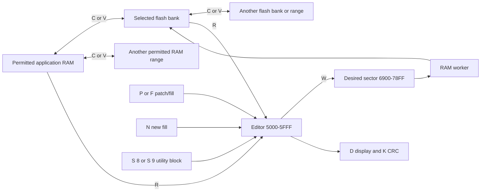

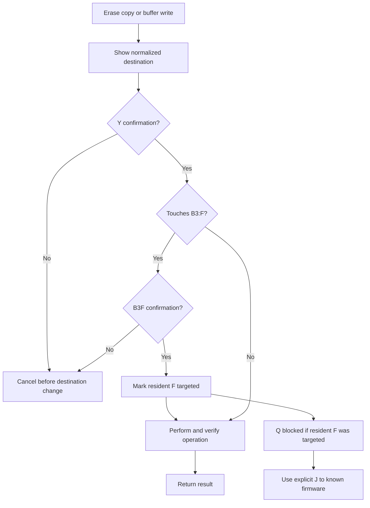

The mark applies when resident F is targeted, even if a subsequent operation
repairs it. Completed sectors remain changed on later failure or cancellation;
there is no multi-sector transaction rollback. CRC is CRC-16/CCITT-FALSE,
polynomial `$1021`, initial `$FFFF`. An archived S 8/S 9 utility needs restoration
to RAM before execution; J 1 does not launch the archive.

## Console display and logging

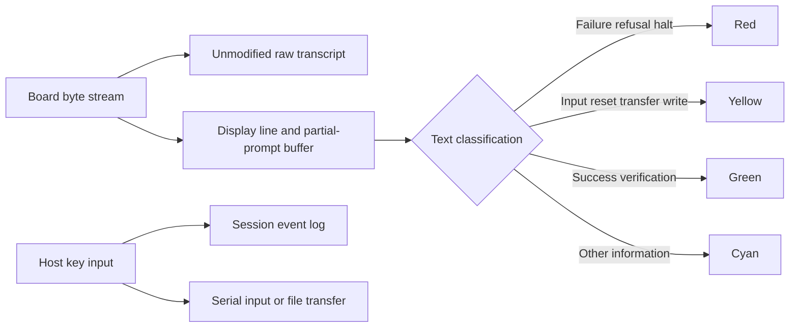

Color is a display aid. Partial text is flushed after approximately 100 ms
of receive inactivity; newline and prompt markers flush earlier. A mixed
success/reset line is yellow because action takes priority. Ctrl-U sends
the core BIN in the installer session; Ctrl-D sends maintenance. Ctrl-] exits.
Do not press a file-transfer key before the corresponding receive prompt.

## Linux launcher

`INSTALL-A24C1.sh` resolves its directory and starts `install_a24c1_linux.py`.
It needs Python 3 and pyserial. On Debian/Ubuntu install them with
`sudo apt install python3 python3-serial`. Use an interactive terminal and a
serial device such as `/dev/ttyUSB0`; the account must have access to the device.

The script sets 115200, 8-N-1, RTS/CTS hardware flow control and DTR false
before opening the port, then requests physical RESET. Linux drivers may still
toggle modem control on open, so installed-monitor reconnect behavior needs
physical testing. It validates the S19 checksum/dense bounds, checks the core
BIN length, asks for physical board confirmation, and reads back every RAM
chunk before issuing the execution command. It never auto-confirms a flash write.

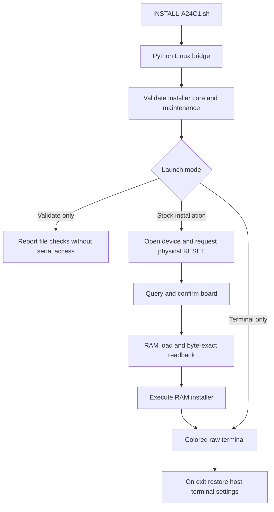

Ctrl-U sends the core during stock installation; Ctrl-D sends maintenance.
In terminal-only mode Ctrl-U sends maintenance. Ctrl-] exits; Ctrl-C is sent
through to the board. Terminal settings are restored on normal exit or error.
The Windows-only Ctrl-B host probe shortcut is not implemented on Linux.
Linux has no raw/event log options in this first launcher; the logging diagram
above describes the Windows bridge. `--validate-only` needs no pyserial and
opens no device. Ubuntu WSL file/protocol tests pass. The owner reported a
successful native Linux run on 2026-10-02.

## Build identity and release checks

| Command or artifact | Purpose |
| --- | --- |
| `make v2-config` | Build core and probes |
| `make v2-config-check` | Core and configuration regression |
| `make v2-config-wdcmon-check` | Build and execute installer model checks |
| `make bank-maint-v2-check` | Maintenance CPU/flash model checks |
| `INSTALL-A24C1.ps1 -ValidateOnly` | File/S19 checks without opening serial |
| Installer manifest | Exact installer/core hashes and backup policy |
| Core build report | Symbol addresses, byte counts and artifact hashes |

The current core F SHA-256 is
`231fbec1b0e6a1e80f4a956009aa74f6259e4f0dfcf761f09f16755832aece36`.
Configured live F differs from the erased-pocket factory image. Validate the
settings separately and compare firmware outside `$FFD0-$FFDF`; retain a hash
of the complete board readback. Installer and bridge hashes change when their
messages or host presentation change; the final package must capture new hashes.

## Board acceptance and remaining qualification

For each CPU family, record physical board identity, COM port, exact image
hashes, bank inventory, backup choice and test result. Acceptance includes
verified stock migration, physical RESET banner/prompt, full power-off/on,
configuration persistence and hold cancellation, S19 load and execution,
bank selection/handoffs, RAM ABI and interrupt checks, and maintenance operations
on known scratch sectors with neighboring-bank preservation.

Repeat backup reuse/refusal and permitted recovery cases separately.
Native-vector behavior needs its own recorded results.
Host-model success is not a substitute for physical qualification. The user
has confirmed the colored script works well; this does not by itself record
completed migration/reset acceptance on both boards. The successful verified
stock migration plus physical reset milestone is still the basis for beta 1.

## Proposed a24c2 differences

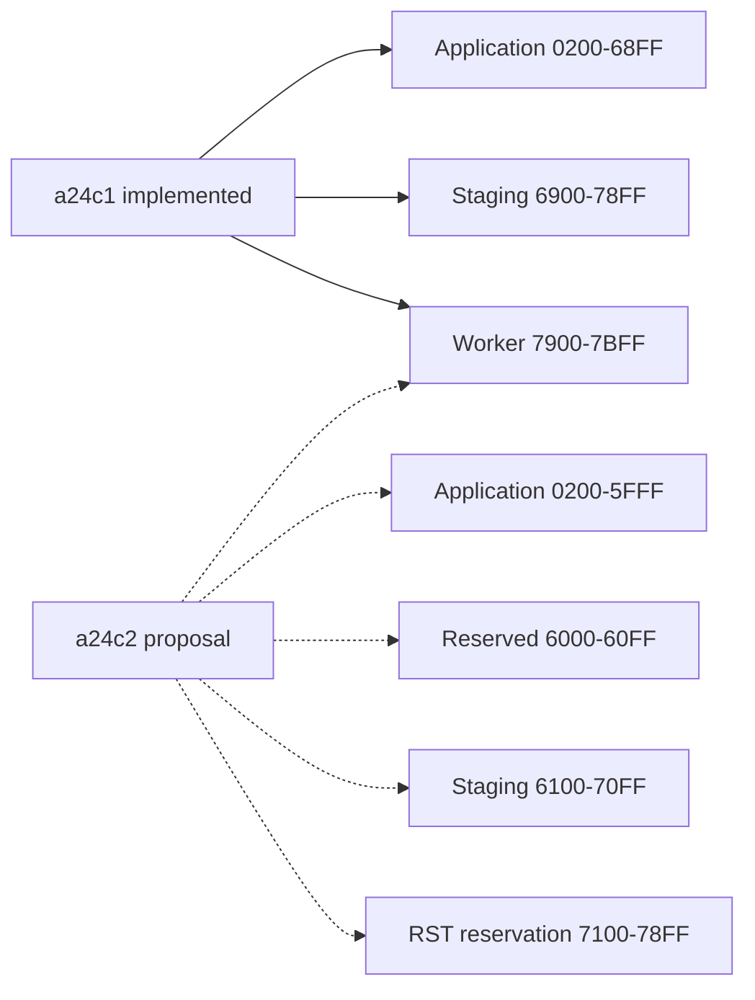

The future maintenance state at `$6000-$61FF` conflicts with that proposal's
reservation/staging boundary and must be reviewed. No a24c2 RST locator field,
copy-length descriptor or RAM entry contract has been assigned. See the
[proposal](STR8N_V2_A24C2_RAM_LAYOUT.md); do not substitute its addresses here.

## Implementation references

- [RAM and hardware definitions](../src/v2-config/str8n-v2-eq.inc)
- [Public interface](../src/v2-config/str8n-v2-public.inc)
- [Configuration implementation](../src/v2-config/str8n-v2-config.inc)
- [Flash worker](../src/v2-config/str8n-v2-flash-worker.inc)
- [Installer policy](../tools/wdcmonv2/a24c1-backup-policy.asm)
- [Bridge](../tools/wdcmonv2/start_wdcmonv2_ram.ps1)
- [Maintenance guide](STR8N_BANK_MAINT_V2.md)
- [Configuration guide](STR8N_V2_FLASH_CONFIG.md)
