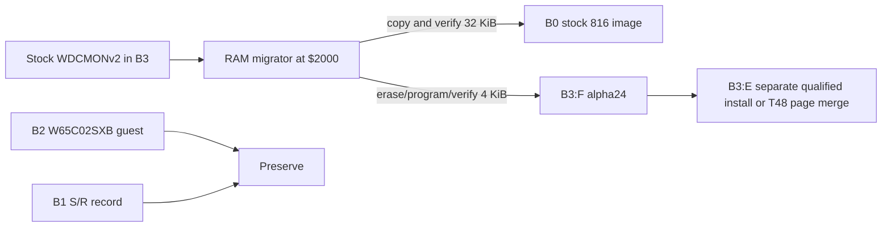

# STR8-N 2.0a24 maps and diagrams

These maps describe the alpha24 W65C816SXB migration kit. The 128 KiB
SST39SF010A is selected in four 32 KiB banks. CPU `$8000-$FFFF` is the
selected bank window; CPU `$0000-$7FFF` contains RAM and I/O.

| Bank | Flash physical range | Board 2609 observed use |
| --- | --- | --- |
| B0 | `$00000-$07FFF` | Original stock W65C816SXB image copied from B3 |
| B1 | `$08000-$0FFFF` | Mostly erased; 28-byte S/R record at CPU `$8000` |
| B2 | `$10000-$17FFF` | W65C02SXB guest; keep intact |
| B3 | `$18000-$1FFFF` | STR8-N 2.0a24 |

## B3 image and T48 offsets

| CPU | Physical chip offset | Size | File / role |
| --- | --- | --- | --- |
| `$8000-$DFFF` | `$18000-$1DFFF` | 24 KiB | B3 data/directory/configuration; preserve or deliberately initialize |
| `$E000-$E7FF` | `$1E000-$1E7FF` | 2 KiB | Existing E margin; generic E BIN is `$FF` here |
| `$E800-$EEFF` | `$1E800-$1EEFF` | 1792 B | Alpha24 S/R/T extension; exact tested slice |
| `$EF00-$EFFF` | `$1EF00-$1EFFF` | 256 B | Existing E margin/configuration; generic E BIN is `$FF` here |
| `$F000-$FFFF` | `$1F000-$1FFFF` | 4 KiB | Alpha24 resident top; F BIN SHA-256 `43e6ee966963e1cc401986581742cc75b302cd0a02cfaf22965fe7ab8a43ec1a` |

The two T48 files each start at offset zero *within their 4 KiB page*. If the
programmer accepts absolute chip offsets, place E at `$1E000` and F at
`$1F000`. If it expects a full-chip buffer, merge those pages into a verified
128 KiB read of the board's own chip at those offsets. Verify the complete
128 KiB programmed result against that merged buffer before reinstalling it.
Confirm the device selection and byte-offset convention in the programmer UI.

## ABI and application loading

The bank tag `SXB?` is a changing WDC monitor identity, not a CPU-mode code.
The host prints the reported tag and requires the physical board model before
RAM loading. Board 2609 reported `SXB6` and is physically W65C816SXB. After
boot, STR8-N reports `65C02 | 816E | 816N-VEC`; application code can query
the public capability/board ABI in `PUBLIC/str8n-v2-public.inc`. The static
bank-maintenance `.s19` loads with monitor `L`, then `G 2000`; its `.a` is an
ASM-F2 ORG/DB carrier of the same bytes. The optional top updater has the same
two carrier formats but only accepts the exact alpha23 B3:F and an erased
B2:F backup sector. It cannot run on board 2609 with its occupied B2.
