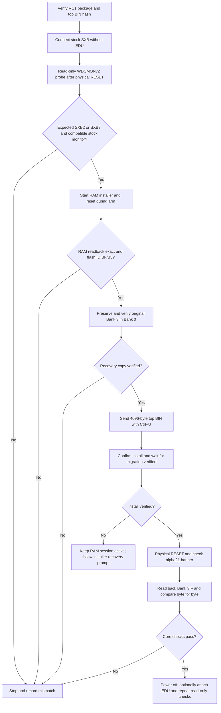

# Getting started: STR8-N 2.0a21 RC1 on W65C02SXB or W65C816SXB/EDU

This is the stock-board installation card for a **W65C02SXB (SXB2)** or
**W65C816SXB (SXB3)** and optional matching EDU. It uses the STR8-N 2.0a21
RC1 ZIP on a Windows host.
STR8-N is intended to run on the SXB **with or without** its matching EDU;
the EDU is not required for the core monitor, USB console, or flash installer.
The alpha21 firmware and corrected stock-board migration have board evidence
on W65C02SXB; W65C816 execution, W65C816 migration, and EDU behavior await
physical testing.
Record each result as you go. A mismatch is a reason to stop before the next
flash step. Use the printable `QUALIFICATION-CHECKLIST-816.md` to record and
sign the physical-board result. The package also includes a fillable,
printable PDF of that record.

The [W65C816SXB datasheet](https://www.westerndesigncenter.com/wdc/documentation/W65C816SXB.pdf)
describes an 8 MHz W65C816S, 32 KB SRAM, four 32 KB overlays in a 128 KB flash,
and the USB FT245 interface through VIA2. The
[WDCMON v2 manual](https://www.westerndesigncenter.com/wdc/documentation/WDCMON_User_Manual_v20.pdf)
describes the stock monitor protocol and the default Bank 3 mapping. The
[W65C816EDU datasheet](https://www.wdc65xx.com/wdc/documentation/W65C816EDU.pdf)
describes the daughterboard connectors and extra hardware. Keep the EDU off
for the first stock-board and alpha21 core checks; attach it with power off
after the core installation passes.

## Installation and verification flow

This is the order of the gates below. It is not a record of an 816 board test. Stop
at any failed gate and record the result before changing flash.



## 1. Prepare the host and package

1. Extract `str8n-v2-rc1.zip` into a writable folder. Use Windows PowerShell
   (`powershell.exe`) in that extracted folder. The board needs a data-capable
   micro-USB cable to a powered host. Install the board's USB driver if Windows
   has not assigned a COM port. Close WDCDB and other serial terminals before
   using the packaged bridge.
2. Identify the board's COM port:

   ```powershell
   [System.IO.Ports.SerialPort]::GetPortNames()
   ```

3. Verify the package before connecting to flash. `MANIFEST.json` contains
   hashes for every packaged file. The 4096-byte
   `FIRMWARE/str8n-v2-alpha21-f000-ffff.bin` must have SHA-256
   `3738eab501c50ef0470e9a81ef573b563da7dc656cc18a83573d16c9bd2e6e49`:

   ```powershell
   Get-FileHash -Algorithm SHA256 .\FIRMWARE\str8n-v2-alpha21-f000-ffff.bin
   ```

   This is the exact Bank 3 F identity read back from board 2512. The archive
   contains no WDCMONv2 firmware or stock-bank image. If you have an external
   programmer, make an owner-local 128 KB flash backup before this first
   migration and keep it private. The RAM installer itself preserves the
   complete original Bank 3 in Bank 0 before changing Bank 3 F.

## 2. Read-only stock-board preflight

With **only the SXB** attached, connect USB and note the board label,
flash-chip marking, COM port, and any stock WDCMON version. The packaged bridge
must be given the expected tag for your board: `SXB2` for W65C02SXB or
`SXB3` for W65C816SXB. Verify the reported identity before proceeding.

Run this **probe-only** command, replacing `COM4` with the actual port:

```powershell
powershell.exe -NoProfile -ExecutionPolicy Bypass -File .\TOOLS\start_wdcmonv2_ram.ps1 `
  -Port COM4 -ExpectedBoardTag SXB2 -ProbeOnly -NoReset -PhysicalResetArmSeconds 60
```

For W65C816SXB, change `SXB2` to `SXB3`. Keep `-ProbeOnly` after the script
path; `-Port COM4` alone requires an image path and is not a probe command.

When the arm message appears, press the board's physical RESET once. Require
`WDCMONV2 PROBE = PASS; NO RAM OR FLASH COMMAND ISSUED` and record the printed
board tag, hardware version, and monitor version. If the reported tag is not
the expected tag, the monitor is not v2-compatible, or the probe cannot communicate,
**stop before loading the RAM installer**. Do not override an unexpected tag
solely to advance the procedure. The stock monitor's published board-info
command is `$0C`; this step sends no RAM or flash write. If the flash chip is
not the installer's expected SST39SF010A (`BF/B5`), the installer later refuses
to write; stop and record the marking.

If the probe times out or fails to synchronize, rerun the command and vary
the delay between the `PHYSICAL RESET ARM` message and pressing physical RESET.
Press RESET once while the arm is active; do not press it before the message.

## 3. Install the alpha21 top sector from RAM

The WDCMONv2 path receives only the 4096-byte alpha21 top BIN. It copies and
byte-verifies the original **entire** Bank 3 into an erased Bank 0, then writes
Bank 3 sector F. It leaves Banks 1 and 2 untouched. A used Bank 0 that differs
from Bank 3 is refused. This path has passed on a W65C02SXB, but has **not**
been run on a W65C816SXB.

Run, using the same COM port. The RC1 launcher automatically accepts `SXB2`
(W65C02SXB) or `SXB3` (W65C816SXB) from WDCMONv2 board-info and reports
the detected family. Other tags are refused before RAM loading. Require the
reported tag to match your board before continuing:

```powershell
powershell.exe -NoProfile -ExecutionPolicy Bypass -File .\START-STR8N-V2-RC1.ps1 `
  -Port COM4
```

Press physical RESET **once while the 60-second arm is active**. Require the
expected `SXB2` or `SXB3` identity, `RAM READBACK = BYTE-EXACT`, and flash ID `BF/B5`
before proceeding. Read the terminal prompts. For an erased Bank 0:

If synchronization still fails before the installer starts, rerun the launcher
and change the delay between the `PHYSICAL RESET ARM` message and the physical
RESET press. Keep that press within the arm window. Never try another RESET
during a RAM transfer or active flash write.

1. At `TYPE COPY B3 TO B0>`, type `COPY B3 TO B0` and Enter. Wait for the
   complete copy and exact comparison. Do not reset or remove power while
   copy/program/verify is active.
2. At `SEND STR8-N TOP BIN; 4096 BYTES; START $F000`, press **Ctrl+U once**.
   The host bridge sends the packaged alpha21 top BIN. Require `STR8-N TOP
   RECEIVED` and then the install prompt. Ctrl+D has no role in this RC1 path.
3. At `TYPE INSTALL STR8-N 2.0a21>`, type **`INSTALL STR8-N 2.0A21`** and Enter.
   The installer uppercases input before matching it. The displayed prompt
   uses lowercase `a`, but the comparison token uses uppercase `A`.
   Wait for `MIGRATION VERIFIED; PRESS PHYSICAL RESET`.
4. Only after that verified message, press physical RESET once. The alpha21
   startup delay is about 6.58 seconds at 8 MHz before console selection.
   Keep the host attached and allow time for the full banner.

If the installer reports a flash failure, **do not reset it**. Leave the RAM
session running and follow its `R=RETRY STR8 O=RESTORE OLD` prompt after
recording the result. A power loss or reset during an active write can require
external reflashing; no interruption-recovery claim is made.

## 4. Verify the first alpha21 boot

The expected startup begins with the line for your board:

```text
STR8-N 2.0a21 B3 65C02    (SXB2)
STR8-N 2.0a21 B3 65C816   (SXB3)
ABI 65C02 | 816E | 816N-VEC
B3>
```

Only one of the two `STR8-N` banner lines appears.

An erased configuration should leave the monitor at `B3>`. If a hold window
appears because the board carries configuration, send `S` during the hold to
remain at the prompt. At `B3>`, use read-only commands:

```text
B
D F000 F003
D 7D01 7D02
```

`D F000 F003` should show `53 4E 02 00` (`SN` v2 signature).
`D 7D01 7D02` should show `02 00` on W65C02SXB or `16 00` on W65C816SXB;
the second byte is FT245 console ID `$00`. Record the banner, prompt, commands,
and results. For a full 4096-byte
Bank 3 F dump on **either** board, send `D F000 FFFF` at `B3>` and wait until
every row from `F000:` through `FFF0:` and the
prompt return. Then exit the bridge terminal with Ctrl+`]` and verify its raw
capture (replace the sample filename with the one printed by the launcher):

```powershell
powershell.exe -NoProfile -ExecutionPolicy Bypass -File .\VERIFY-STR8N-V2-READBACK.ps1 `
  -TranscriptPath .\LOCAL\v2-rc1-migration-YYYYMMDD-HHMMSS.raw
```

Require `BANK 3 F READBACK = BYTE-EXACT PASS`. An incomplete or differing
capture fails rather than inferring success. Keep the capture and SHA-256 with
the board ID. The first boot alone does not qualify native interrupts or guest
software.

Exit the bridge terminal only after the board is idle. Its raw capture and
`.events.txt` files are under the extracted package's `LOCAL/`
folder. Keep any stock-monitor bytes in owner-local files and out of a public
issue, repository commit, or release archive.

## 5. Add the EDU and expand qualification (W65C816SXB only)

After the SXB passes the core checks, power it off. Align the EDU's J1-J4
connectors with the SXB's matching headers according to the
[EDU board drawing](https://www.wdc65xx.com/wdc/documentation/W65C816EDU.pdf);
inspect for shifted or bent pins before reconnecting USB. Keep external Grove,
Qwiic, OLED, and mikroBUS modules disconnected for this first check. The EDU
uses those SXB connectors and adds expansion RAM and peripherals; their
operation is a separate qualification layer.

Reconnect USB and repeat the banner, `B`, and read-only `D` checks. Observe
and record any LED or buzzer behavior, but do not use it as the only success
criterion. The STR8-N 2.0 RC1 claim does not yet include EDU-specific behavior.
The repository's `docs/STR8N_V2_816_NATIVE_ACCEPTANCE.md` is a later RAM-only
test for W65C816 BRK/NMI vector behavior; it is
not part of the public RC1 ZIP or a prerequisite to this first installation.
